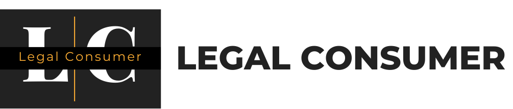
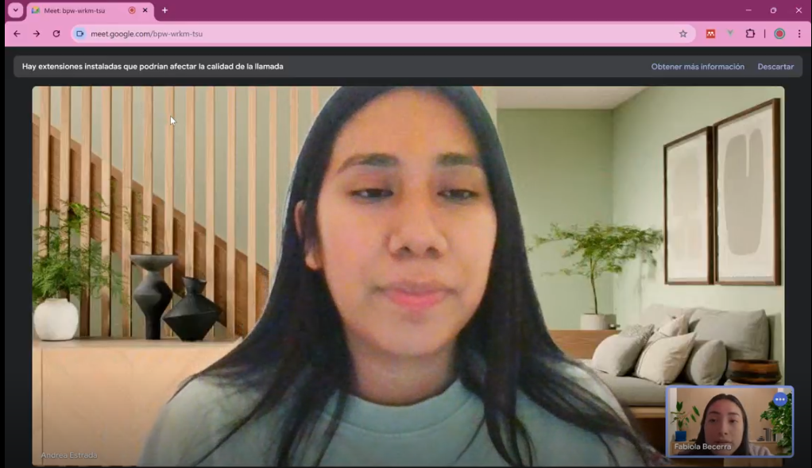

# Capítulo 2: Requirements Elicitation & Analysis

## 2.1. Competidores

### 2.1.1. Análisis competitivo

#### Competitive Analysis Landscape

El objetivo del siguiente análisis competitivo es identificar las fortalezas y debilidades de las aplicaciones enfocadas en casos de negligencia médica, para desarrollar diseños y estrategias efectivas.

| Competidor          | Legal Consumer | Abogado.com   | Poulos y Coates, LLP | LexMedd  |
| ------------------- | -------------- | ------------- | ---------------------| --------------- |
| **Logo**            |  |  |  | |
| **Perfil**          | Aplicación Web | Aplicación Web| Ejecutable           | Aplicación Web  |
| **Ventaja competitiva** | Facilita la conexión entre pacientes y abogados especializados en negligencia médica. | Ofrece una plataforma para conectar a usuarios con abogados de diversas especialidades, incluyendo negligencia médica. | Bufete especializado en casos de negligencia médica con décadas de experiencia. | Plataforma integral de gestión para abogados enfocados en negligencia médica. |
| **Perfil de Marketing** | Personas que buscan asesoría legal en casos de negligencia médica. | Consumidores que necesitan representación legal en diversas áreas, incluyendo negligencia médica. | Pacientes que buscan un bufete especializado y con experiencia en casos complejos de negligencia médica. | Despachos de abogados que se especializan en casos de negligencia médica. |
| **Estrategias de marketing** | SEO y marketing de contenidos dirigidos a pacientes. | Publicidad online y SEO en plataformas legales. | Recomendación de boca en boca y presencia en comunidades médicas. | Marketing digital y colaboraciones con bufetes especializados. |
| **Perfil de Producto** | Conexión con abogados, recursos legales y casos de estudio. | Directorio de abogados, consultas legales, contenido informativo. | Servicios de representación legal en casos de negligencia médica. | Herramientas de gestión de casos, seguimiento de expedientes, facturación, etc. |
| **Precios & Costos** | Tarifas basadas en el caso o consulta inicial gratuita. | Diferentes precios según el abogado y el caso. | Tarifas basadas en la complejidad del caso y la experiencia del bufete. | Planes desde $39/mes para despachos pequeños. |
| **Canales de distribución** | Web | Web | Web | Web y Móvil |
| **Análisis SWOT** | **Fortalezas** | Especialización en conectar pacientes con abogados expertos. | Amplia base de usuarios y variedad de especialidades legales. | Alta reputación y experiencia en casos de alta complejidad. | Solución integral para la gestión de casos legales en negligencia médica. |
|                     | **Debilidades** | Compite con despachos tradicionales y otras plataformas online. | Falta de enfoque específico en negligencia médica. | Costo elevado de servicios. | Menor reconocimiento de marca comparado con competidores establecidos. |
|                     | **Oportunidades** | Expansión en el mercado internacional. | Ampliación de servicios legales personalizados. | Crecimiento en nuevas áreas de la ley médica. | Integración con otras herramientas legales y médicas. |
|                     | **Amenazas** | Competencia con plataformas más grandes y despachos tradicionales. | Cambios en la regulación legal o en la demanda de servicios legales. | Aumento de competencia con bufetes emergentes. | Competencia de soluciones más asequibles. |

### 2.1.2. Estrategias y tácticas frente a competidores

Teniendo en cuenta el análisis SWOT previamente presentado para LexMedd, proponemos las siguientes estrategias y tácticas competitivas:

#### Estrategia 1: Diferenciación a través de la especialización en negligencia médica
- **Táctica 1.1:** Desarrollar funcionalidades específicas que aborden los desafíos únicos de la negligencia médica, como herramientas para la gestión de registros médicos, análisis de pruebas, y plantillas personalizadas para la redacción de demandas.
- **Táctica 1.2:** Crear una base de datos integrada de expertos médicos y legales que sea accesible desde la plataforma, estableciendo acuerdos con asociaciones médicas y bufetes especializados.

#### Estrategia 2: Enfoque en la facilidad de uso y la eficiencia
- **Táctica 2.1:** Simplificar la interfaz de usuario y optimizar el flujo de trabajo para que los abogados puedan gestionar casos complejos de manera más eficiente.
- **Táctica 2.2:** Implementar opciones de personalización que permitan a los usuarios adaptar la plataforma a sus necesidades específicas, y automatizar procesos repetitivos.

#### Estrategia 3: Liderazgo en costos para pequeños despachos especializados
- **Táctica 3.1:** Ofrecer planes de precios competitivos, diseñados específicamente para despachos pequeños o abogados individuales que se especializan en negligencia médica.
- **Táctica 3.2:** Introducir modelos de pago flexibles, como planes de suscripción escalonados o descuentos para nuevos usuarios, que atraigan a clientes con recursos limitados.

#### Estrategia 4: Alianzas estratégicas con asociaciones médicas y legales
- **Táctica 4.1:** Establecer alianzas con asociaciones médicas, hospitales, y organizaciones legales especializadas en negligencia médica para aumentar la visibilidad y credibilidad de LexMedd.
- **Táctica 4.2:** Colaborar en la organización de eventos, seminarios, y conferencias dirigidos a abogados especializados en negligencia médica, para fortalecer la red de contactos y promover la plataforma.

#### Estrategia 5: Innovación continua y actualización tecnológica
- **Táctica 5.1:** Incorporar nuevas tecnologías, como inteligencia artificial, para mejorar la predicción de resultados de casos, el análisis de tendencias en demandas de negligencia médica, y la automatización de procesos legales.
- **Táctica 5.2:** Mantener un ciclo constante de desarrollo y actualización de la plataforma para asegurar que LexMedd se mantenga a la vanguardia en el mercado legal.

### 2.2 Entrevistas
La sección abarca el proceso de investigación de nuestros segmentos objetivos mediante la recolección de información en base
a entrevistas.

### 2.2.1. Diseño de entrevistas.

### Entrevista para LexMedd

### Entrevista para Médicos

#### Preguntas Principales:

1. **¿Podría proporcionarnos su nombre completo y su especialidad médica?**
2. **¿Cuánto tiempo de experiencia posee en su especialidad y cuál es su rol actual en su práctica médica?**
3. **¿Qué actividades desempeña relacionadas con la documentación y reporte de casos de posibles negligencias médicas?**
4. **¿Cómo interactúa con su equipo para asegurar que los informes médicos sean precisos y completos en casos de negligencia médica?**
5. **¿Podría describir el proceso de documentación de un caso de negligencia médica desde la perspectiva médica?**
6. **¿Con qué frecuencia documenta los procesos relacionados con la atención médica de los pacientes?**
7. **¿Considera tedioso el registro de procesos médicos? ¿Cómo cree que podría agilizarse u optimizarse este proceso?**
8. **¿Cuál es la importancia de la documentación precisa en la gestión de casos de negligencia médica?**
9. **¿Qué desafíos enfrenta en la recopilación y presentación de pruebas médicas en casos de negligencia?**
10. **¿Qué funcionalidades considera que debe tener una aplicación web para ayudar en la documentación de casos médicos relacionados con negligencia?**
11. **¿Cuál de estas características cree que es más importante en una aplicación web: velocidad, facilidad de uso o una interfaz amplia?**
12. **¿Qué problemas cree que podrían surgir del uso de dicha aplicación en la gestión de casos de negligencia médica?**

### Entrevista para Abogados

#### Preguntas Principales:

1. **¿Podría proporcionarnos su nombre completo y su especialidad legal?**
2. **¿Cuánto tiempo de experiencia posee en el campo del derecho y si es asi en la gestión de casos de negligencia médica?**
 

En el caso de que la respuesta sea si proceden las siguientes preguntas:
1. **¿Qué actividades desempeña en la gestión de casos de negligencia médica dentro de su práctica legal?**
2. **¿Cómo interactúa con su equipo para asegurar que los casos de negligencia médica se gestionen de manera eficiente y efectiva?**
3. **¿Podría proporcionar una descripción general del proceso legal de un caso de negligencia médica, desde la evaluación inicial hasta su resolución?**
4. **¿Con qué frecuencia documenta y registra los procesos legales relacionados con los casos de negligencia médica?**
 

En el caso de que la respuesta sea NO proceden las siguientes preguntas:
1. **¿Considera tedioso el registro de procesos legales? ¿Cómo cree que podría agilizarse u optimizarse este proceso?**
2. **¿Cuál es la importancia de la documentación precisa y detallada en la gestión legal de casos?**
3. **¿Cómo evalúa la efectividad de la gestión legal de un caso de negligencia médica? ¿Qué indicadores utiliza para medir el éxito?**
4. **¿Cómo se comunica la información sobre el estado y progreso de un caso de negligencia médica con otros departamentos o equipos?**
5. **¿Qué funcionalidades considera que debe tener una aplicación web para ayudar en la gestión legal de casos de negligencia médica?**
6. **¿Cuál de estas características cree que es más importante en una aplicación web: velocidad, facilidad de uso o una interfaz amplia?**
7. **¿Qué problemas cree que podrían surgir del uso de dicha aplicación en la gestión legal de casos de negligencia médica?**

### 2.2.2 Registro de Entrevistas.

En el proceso de investigación para nuestro proyecto, se llevaron a cabo entrevistas del público objetivo. Cada entrevista se documentó en video y se registraron los siguientes detalles:

**URL del video completo:** 

#### Segmento objetivo: Abogado

#### Entrevista 1 : Carla Andrea Estrada

**Nombre y Apellido:** Carla Andrea Estrada

**Edad:** 25

**Distrito:** Lima

**Screenshot de la Entrevista:** 

**Timelapse:** [Inicio: 09:11, Fin: 21:11]

**Resumen:**
La abogada Andrea lleva dos años ejerciendo su carrera en el área legal, específicamente en casos de negligencia médica. Nos cuenta que actualmente no dispone de una aplicación que le ayude a gestionar sus casos de manera eficiente. En la actualidad, se comunica con sus clientes mediante reuniones y a través de la aplicación WhatsApp, lo cual, en algunos casos, le consume mucho tiempo y dificulta una comunicación fluida.

Además, comenta que disponer de una herramienta o aplicación que le permita programar citas y encontrar nuevos casos le sería de gran ayuda en su desarrollo profesional. También menciona que la implementación de un sistema que le facilite la gestión de documentos, alertas y el seguimiento de los casos en tiempo real sería muy beneficiosa. Respecto a la seguridad de los datos y la privacidad de sus clientes, subraya la importancia de manejar esta información con total discreción, ya que se trata de datos sensibles.

Por último, Andrea nos explica que, al igual que otros colegas, utiliza aplicaciones con interfaces intuitivas, las cuales facilitan la implementación y gestión de estos casos.
 

#### Segmento objetivo: Médico

#### Entrevista 1: Augusto Manuel Vasquez Carrasco (Medico)
 
**Nombre y Apellido:** Augusto Manuel Vasquez Carrasco

**Edad:** 46

**Distrito:** San Borja

**Screenshot de la Entrevista:**

.png)

**Timelapse:** [Inicio: 09:11, Fin: 21:11]

**Resumen:**

Augusto Manuel Vásquez Carrasco, un médico cirujano con una vasta experiencia desde que se graduó en el 2005 y se especializó en Anestesiología desde el 2010, con una posterior subespecialización en Anestesiología Pediátrica, desempeña su labor en el INSN en San Borja y en diversas clínicas privadas. Él enfatiza la complejidad y singularidad de cada intervención quirúrgica, especialmente en cirugías de alto nivel que realiza en instituciones reconocidas por realizar procedimientos complejos. Destaca que cada paciente es único y requiere una atención personalizada y concentrada, aunque pueda haber casos clínicos similares. Aunque no ha enfrentado problemas médicos legales, reconoce que las complicaciones son una parte esperada en su campo y que siempre está preparado para manejarlas. Además, menciona que ha sido testigo de la falta de comunicación entre médicos y familias de pacientes en situaciones críticas, y en esos casos, ha brindado apoyo médico para la defensa de sus colegas. Para enfrentar problemas legales, Augusto ha ampliado su formación y se ha capacitado como perito en anestesiología, lo que le proporciona las habilidades necesarias para defenderse con mayor eficacia. Al igual que en la entrevista anterior podemos verificar que tambien utiliza una computadora de escritorio y un smartphone android para poder hacer sus tareas diarias respecto a su profesión.

#### Entrevista 2: Liliana Edith Requejo Lozada (Medico)

**Nombre y Apellido:** Liliana Edith Requejo Lozada

**Edad:** 48

**Distrito:** Jesus Maria

**Screenshot de la Entrevista:**

.png)

**Timelapse:** [Inicio: 21:20, Fin: 26:57]

**Resumen de la Entrevista:**

Liliana Requejo, obstetra con 20 años de experiencia, 13 de los cuales se han dedicado a la obstetricia, trabaja en el Centro de Salud de Jesús María, donde se especializa en atención prenatal, parto y posparto. Además, participa en cirugías menores como la colocación de métodos anticonceptivos y otros procedimientos ginecológicos. A lo largo de su carrera, ha enfrentado algunas complicaciones durante los partos, como hemorragias o distocias de hombros, pero ha logrado resolverlas con éxito. En cuanto a problemas legales, menciona un caso en el que un colega enfrentó demandas debido al fallecimiento de un bebé durante un parto complicado, aunque ella no estuvo directamente involucrada en el caso. Si ella enfrentara un problema similar en el futuro, buscaría asesoramiento legal y profesional para manejar la situación de manera adecuada y ética, reconociendo sus limitaciones y buscando la mejor solución para el paciente y su familia. En este caso, Liliana nos comenta que ella utiliza un smartphone android para realizar sus actividades y una laptop para que le sea posible interactuar con sitios web.

### 2.2.3 Análisis de Entrevistas

**Análisis por segmento: abogado**

 La entrevista con Andrea revela varias oportunidades para mejorar su eficiencia en la gestión de casos de negligencia médica. Actualmente, carece de una herramienta específica para organizar su trabajo, lo que la obliga a depender de WhatsApp para la comunicación con clientes, un método que le consume mucho tiempo. Andrea necesita una plataforma que centralice la gestión de casos, con funciones para programar citas, almacenar y organizar documentos, y ofrecer seguimiento en tiempo real. También destaca la importancia de garantizar la privacidad y seguridad de los datos sensibles de los clientes, así como la preferencia por interfaces intuitivas que faciliten su uso. Implementar una solución con estas características optimizaría considerablemente su trabajo diario.

**Análisis por segmento: Medico**

 Las entrevistas con Augusto Manuel Vásquez Carrasco y Liliana Requejo revelan desafíos y necesidades particulares en sus respectivas especialidades médicas. Augusto, con una amplia experiencia en Anestesiología, enfrenta la complejidad de cada intervención quirúrgica, destacando la importancia de la atención personalizada y su preparación adicional como perito en anestesiología para manejar posibles problemas legales. Aunque no ha tenido problemas médicos legales, está atento a la comunicación deficiente entre médicos y pacientes en situaciones críticas. Por su parte, Liliana Requejo, obstetra con 20 años de experiencia, enfrenta complicaciones durante los partos y busca asesoramiento legal en caso de problemas similares. Utiliza un smartphone Android y una laptop para gestionar sus tareas, destacando la importancia de herramientas tecnológicas adecuadas para el manejo efectivo de su trabajo diario. Ambos profesionales muestran una integración de la tecnología en su práctica, pero también una necesidad de sistemas que apoyen la gestión de la comunicación y la prevención de complicaciones legales.

##  2.3 Needfinding.

 En esta sección se presentarán los artefactos resultantes del proceso de análisis de la información recolectada de los segmentos objetivos. Aquí se incluyen secciones internas para User Personas, User Task Matrix, User Journey Maps, Empathy Mapping y As-Is Scenario Mapping.

### 2.3.1 User personas
 En esta sección se presentan personajes ficticios que representan los segmentos objetivos identificados y entrevistados a través de user personas. Los datos que se colocan incluye demografía, personalidad, motivaciones, preferencias, objetivos, desafíos y comportamientos, así como también detalles sobre cómo el usuario interactúa con productos similares. Los datos se justifican con las entrevistas que hemos realizado anteriormente. Para el desarrollo de esta sección se ha utilizado la herramienta UXPressia que ofrece facilidades para generar los user personas.

## User persona Medico 

## User persona Abogado 

### 2.3.2 User Task Matrix

#### Dr. Alejandro Gómez (Médico)

| **TAREA**                                     | **FRECUENCIA** | **IMPORTANCIA** |
|-----------------------------------------------|----------------|-----------------|
| Documentar casos de negligencia médica        | Siempre        | Alta            |
| Revisar registros médicos                     | Frecuentemente | Alta            |
| Coordinar con el equipo legal                 | A veces        | Alta            |
| Reportar incidentes críticos                  | A veces        | Alta            |
| Asistir a reuniones legales                   | A veces        | Media           |
| Colaborar en la elaboración de informes       | Frecuentemente | Alta            |
| Actualizar historial médico del paciente      | Siempre        | Alta            |
| Participar en capacitaciones legales          | A veces        | Media           |
| Realizar consultas de seguimiento             | Siempre        | Alta            |
| Usar software de gestión de casos             | Frecuentemente | Alta            |

#### Lic. María Fernández (Abogada)

| **TAREA**                                     | **FRECUENCIA** | **IMPORTANCIA** |
|-----------------------------------------------|----------------|-----------------|
| Revisar casos de negligencia médica           | Siempre        | Alta            |
| Analizar pruebas médicas                      | Frecuentemente | Alta            |
| Coordinar con el equipo médico                | A veces        | Alta            |
| Redactar documentos legales                   | Siempre        | Alta            |
| Asistir a audiencias                          | Frecuentemente | Alta            |
| Negociar acuerdos legales                     | A veces        | Alta            |
| Brindar asesoría legal al personal médico     | Frecuentemente | Alta            |
| Actualizar la base de datos de casos          | A veces        | Media           |
| Participar en capacitaciones médicas          | A veces        | Media           |
| Usar software de gestión de casos             | Frecuentemente | Alta            |

### Observaciones

- **Médicos**: Las tareas más frecuentes e importantes giran en torno a la documentación y la colaboración con equipos legales, así como la actualización constante de registros médicos.
- **Abogados**: Las tareas se centran en la revisión de casos, la preparación de documentos legales y la coordinación con el equipo médico. La importancia y la frecuencia están alineadas con la necesidad de preparar y presentar casos de manera efectiva.

### 2.3.3 User Journey Mapping
En la presente sección se ilustra el end-to-end journey de la aplicación LexMedd para los segmentos objetivos,Medicos y abogados. El User Journey Mapping empieza desde el momento en el que el cliente adquiere conocimiento de la aplicación pasando por el prorceso de tomar la decisión de usarlo, registrarse, hacer uso de este mismo y
finalmente la posibilidad de que deje de hacer uso de este mismo.

#### Dr. Alejandro Gómez (Médico)

#### Lic. María Fernández (Abogada)

### 2.3.4 Empathy Mapping

#### Dr. Alejandro Gómez (Médico)

#### Lic. María Fernández (Abogada)

 

### 2.3.5. As-is Scenario Mapping
Haciendo uso del brainstorming se identificaron las fases de acuerdo a lo propuesto en los user persona. De este modo, hemos conseguido realizar los As-Is Mapping para los segmentos dados.

**_Segmento Objetivo 1: Abogados especializados en derecho médico_**

**_Segmento Objetivo 2: Doctores que enfrentan problemas legales por mala praxis_**

