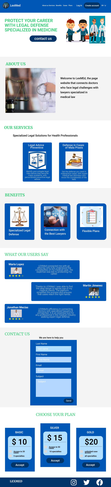
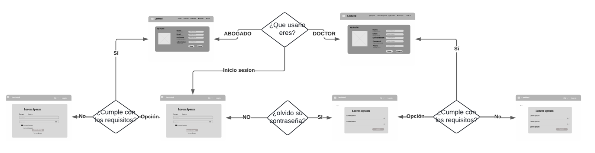
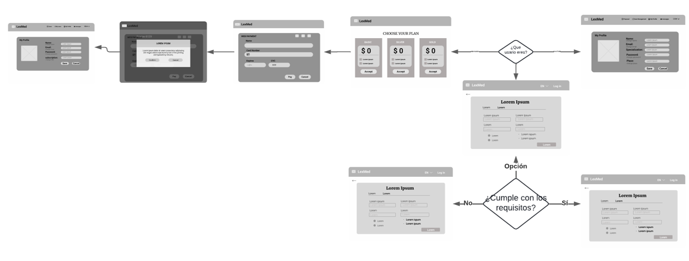
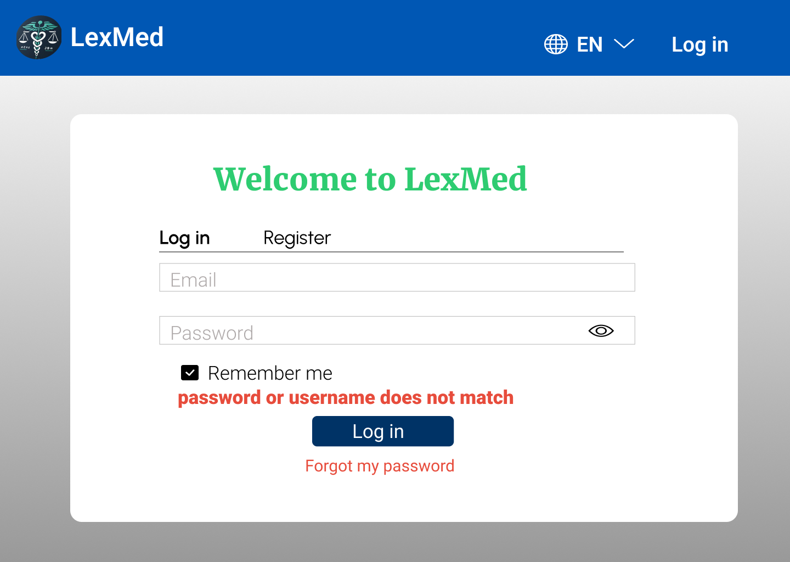
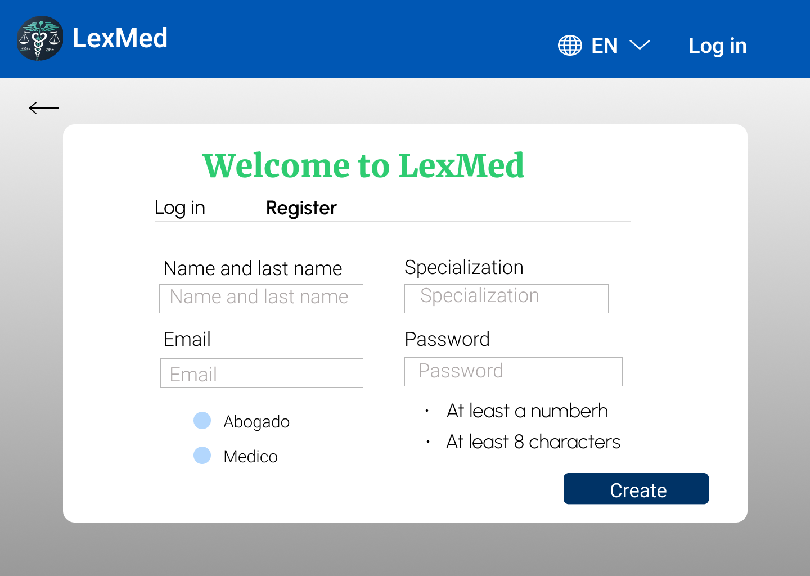
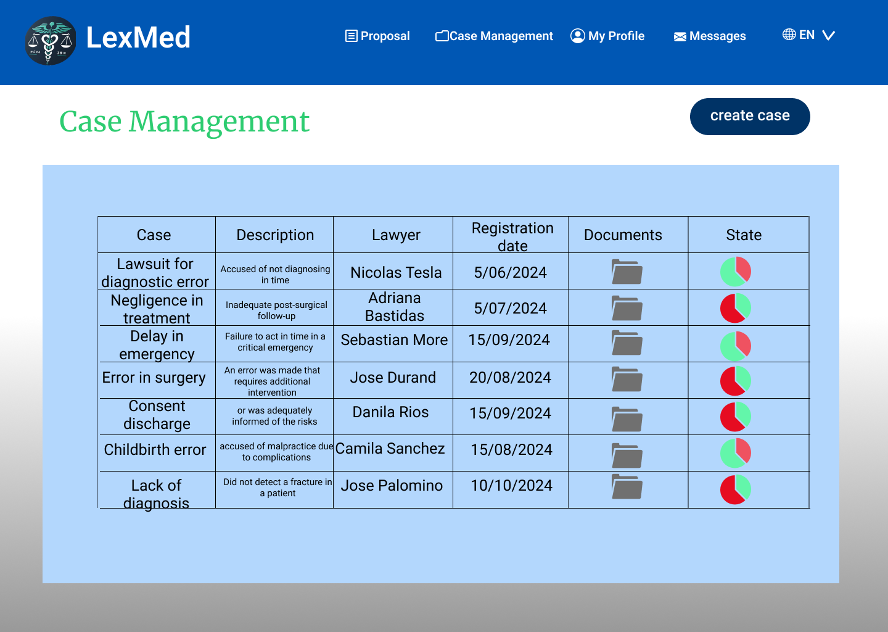
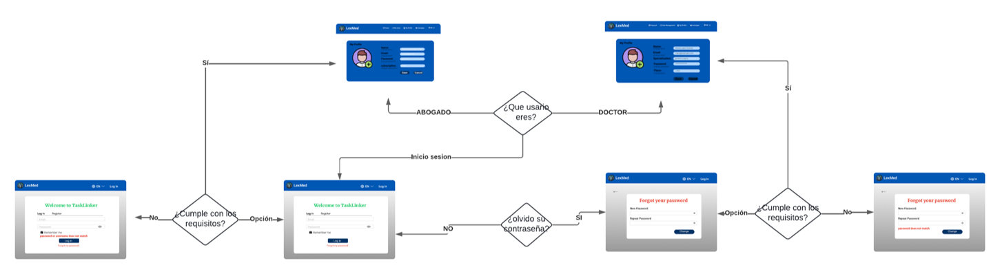
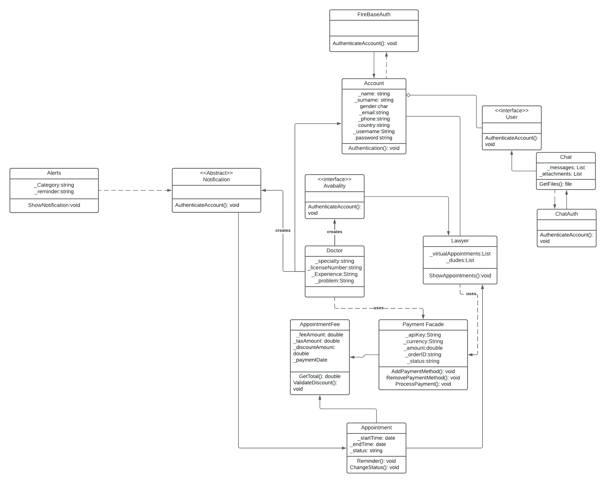
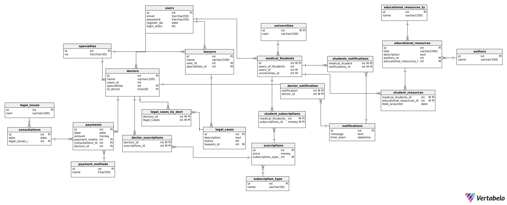

# <a name="_dzv1abs4l4xt"></a>Capítulo IV: Product Design 
## <a name="_mu9vw6k7b4rn"></a>4.1. Style Guidelines.
Con base en los principios de diseño de LexMed, las "guías de estilo" describen los procedimientos para redactar, diseñar o presentar documentos, contenido web, software u otros trabajos creativos, describiendo parámetros esenciales como la identidad de marca, la paleta de colores, la tipografía. 
## <a name="_ueh5qo8mel3e"></a>4.1.1. General Style Guidelines. 
**Branding:**

LexMed representa la confianza, especialización y empoderamiento tanto de abogados como de médicos. Proporcionamos una serie de servicios y herramientas diseñadas para facilitar la conexión y colaboración entre abogados especializados en derecho médico y médicos que enfrentan problemas legales.

**Logotipo:** 

La elección del logotipo de LEXMed se basa en la necesidad de comunicar claramente la misión y los valores fundamentales de la plataforma, que se centra en la intersección entre la medicina y el derecho.

- Caduceo Médico: Este símbolo es ampliamente reconocido en todo el mundo como un emblema de la medicina. Al colocar el caduceo en el centro del logotipo, destacamos nuestro compromiso principal con los profesionales de la salud y la importancia de brindarles el apoyo necesario en asuntos legales.
- Balanza de la Justicia: La balanza es un símbolo universal de justicia, equidad y legalidad. Su inclusión en el logotipo enfatiza la esencia legal de LEXMed, que busca ofrecer a los médicos una representación justa y especializada en casos de mala praxis o negligencia.
- Integración del Corazón: El corazón entrelazado con el caduceo sugiere que la plataforma no solo se basa en la técnica y el conocimiento, sino también en la ética, la empatía y el cuidado. Esto refleja la misión de LEXMed de proteger tanto los derechos de los médicos como los intereses de los pacientes, siempre con un enfoque humanizado.
- Colores y Estética: Los colores utilizados en el logotipo, predominantemente verde y blanco, están asociados con la salud, la pureza y la tranquilidad. Estos colores refuerzan la imagen de LEXMed como una plataforma confiable, ética y dedicada al bienestar de sus usuarios.

En conjunto, este logotipo no solo es una representación visual atractiva, sino que también encapsula la esencia de lo que LEXMed representa: la unión armoniosa entre la medicina y el derecho para asegurar que se haga justicia con integridad y profesionalismo.
<p align="center">
  
</p>

<div align="center">
**Tipografías:** 

Para garantizar una combinación de modernidad y profesionalismo, hemos seleccionado cuidadosamente las fuentes tipográficas para la plataforma. Optamos por Merriweather para los títulos, debido a su elegancia y claridad, y Roboto.   Esta combinación asegura una legibilidad óptima y una coherencia visual que refuerza la identidad profesional de la plataforma.

**Merriweather:** 

<p align="center">
  
</p>

<div align="center">

*Figura 1: imagen extraída de esccooltext* 

**Roboto:**

<p align="center">
  
</p>

<div align="center">

*Figura 2: imagen extraída de University of Evansille*

**Paleta de Colores**: 

La selección de la paleta de colores para "LexMed" se basa en principios estratégicos que refuerzan la identidad visual y funcionalidad de la plataforma:

- Azul Marino (#003366): Representa confianza y profesionalismo, este color se usa para los botones 
- azul (0057B4):  se usa para encabezados y barras de navegación 
- Blanco (#ffffff): Fondo principal para mantener claridad y enfoque en el contenido.
- Gris Claro (#F4F4F4): Para fondos secundarios y secciones con menor importancia.
- Verde Esmeralda (#2ECC71): Para indicar acciones positivas, confirmaciones y éxito.
- Rojo (#e74c3c): Asociado con advertencias y situaciones críticas, se reserva para resaltar errores y alertas.

` `En conjunto, estos colores no solo cumplen funciones estéticas, sino que también juegan un papel crucial en la usabilidad y experiencia del usuario, asegurando que la plataforma "LexMed" sea intuitiva, confiable y efectiva.

<p align="center">
  
</p>

<div align="center">

*Figura 2: imagen extraída de Coolors*
**Tonos de comunicación:** 

El estilo de comunicación que se utiliza en el diseño, puede ser:

- **Formal/Confianza:** En LexMed adoptamos un enfoque formal que refleja nuestra seriedad
- Además, mantenemos un toque de accesibilidad y cercanía en nuestra comunicación con los usuarios.
- **Memorable y reconocible:** La identidad de marca debe ser única y fácilmente identificable. Esto ayudará a que la empresa se destaque de la competencia y sea recordada por los usuarios.
- **Respetuoso/Irreverente:** Nos caracterizamos por ser siempre respetuosos y considerados en nuestra comunicación, mostrando empatía hacia las necesidades y preocupaciones de nuestros usuarios.
- **Entusiasta/Sereno:** EnLexMed transmitimos entusiasmo al ofrecer nuestros servicios a nuestros usuarios, al mismo tiempo mantenemos un tono sereno para transmitir confianza y estabilidad.

**Lenguaje aplicado:**

El lenguaje que se utiliza en el diseño, debe ser claro, conciso y fácil de entender.

**Marca:**

El nombre de la empresa, "LexMed", es un juego de palabras con la palabra “lex” que es el latin que se refiere a legal y “Med” palabra en inglés que se refiere a medicina. Esto transmite la idea de que la empresa puede ayudarte con tus problemas legales.

**Spacing:**

El espaciado entre los elementos del logotipo es uniforme y equilibrado. Esto crea una sensación de orden y armonía. El espaciado entre las letras del nombre de la empresa es entre 0 y 16 para que sean legibles,y no tan separadas

## <a name="_54b476lxjh64"></a>4.1.2. Web Style Guidelines.
***Fuentes:**  Se usó  Merriweather con el estilo Médium para el título y para el cuerpo se usó Roboto con  4 estilos (Medium, SemiBold, Regular, y ExtraLight). 

<p align="center">
  
</p>

<div align="center">

**colores:** Se usan los colores según especificado en el apartado “General Style Guidelines” 

<p align="center">
  
</p>

<div align="center">


**Enlaces y botones:** Los botones primarios estarán con un fondo azul marino y texto blanco, con un borde redondeado de 35px.

**Pantallas emergentes:** Tienen el objetivo de confirmar las acciones clave del funcionamiento de la app.

**Estilo de Imágenes y Gráficos:** Todas las imágenes deben tener una resolución mínima de 72px.

**Espaciado y Márgenes:** Márgenes de 20px entre secciones principales y 10px entre componentes individuales.

**Formulario y Campos de entrada:** Los formularios se utilizan para el registro de entrada.

**Tablas:** Cada fila representa un caso y cada columna la información del abogado o médico.**  	

## <a name="_o51hfrc0q8ne"></a> 4.2. Information Architecture.
La arquitectura de la información es el fundamento de la experiencia de usuario en LEXMed, en este caso se alinea con Arquitectura de Información Orientada al Usuario. ya que se enfoca en las necesidades, tareas y flujos de los usuarios, en este caso, abogados y médicos.  Se organiza en función de cómo estos usuarios interactúan con la plataforma y qué información necesitan en cada punto de su experiencia.

Este tipo de arquitectura es efectiva para plataformas donde los usuarios tienen roles definidos y necesidades específicas, asegurando que puedan completar sus objetivos de manera eficiente y con una experiencia de usuario optimizada.

## <a name="_ii3875icyjhz"></a> 4.2.1. Organization Systems.
EEl sistema de organización en LEXMed está cuidadosamente diseñado para estructurar el contenido de manera lógica y accesible, garantizando que los usuarios puedan navegar y localizar los recursos relevantes con facilidad. Para lograrlo, se establece una j**erarquía clara** en la que todo el contenido se organiza en una estructura bien definida. Las secciones principales, como "Inicio", "Servicios", Médicos ","Abogados ","Casos ","Recursos ", y "Planes", se presentan de manera destacada y son accesibles directamente desde el menú principal.

La categorización del contenido es otro aspecto fundamental del sistema. Los materiales se agrupan en categorías coherentes para facilitar la búsqueda. Por ejemplo, la sección de **"Servicios"** ofrece un desglose detallado de los servicios disponibles tanto para médicos como para abogados, mientras que la sección de **"Casos"** organiza los casos según la especialidad médica o el tipo de problema legal. Además, la sección de **"Recursos**" reúne documentación y guías legales, artículos de interés y preguntas frecuentes, proporcionando a los usuarios un acceso rápido a la información que necesitan. Por último, **"Planes"** es una sección específica que detalla las opciones de suscripción, comparando los beneficios y precios de las opciones:

- Basic: El abogado tiene acceso a un máximo de 20 médicos para referir su caso.
- Silver: El abogado puede acceder a hasta 50 médicos para referir su caso.
- Gold: El abogado tiene acceso ilimitado a todos los médicos disponibles, pudiendo elegir libremente a quién referir su caso.

El sistema también está diseñado para ser adaptable, permitiendo la adición de nuevas categorías o subcategorías sin comprometer la estructura existente. Esto asegura que la plataforma pueda evolucionar y expandirse según las necesidades de los usuarios, manteniendo siempre una organización clara y eficiente.
## <a name="_iqxnky7ldi0l"></a> 4.2.2. Labeling Systems.
LEXMed utiliza un sistema de etiquetado claro y consistente para garantizar que los usuarios puedan encontrar lo que buscan sin confusión.

|Etiqueta|Definición |
| :-: | :-: |
|Contact|Etiqueta utilizada para identificar la información de contacto de los doctores y abogados involucrados en un caso. Facilita la comunicación directa y rápida entre las partes interesadas.|
|Priority|Etiqueta que indica el nivel de urgencia de un caso, permitiendo a los usuarios enfocar sus esfuerzos en los asuntos más críticos y urgentes primero.|
|Recent Cases|Etiqueta que marca los casos más recientemente añadidos o actualizados en la plataforma.|
|Medical Specialty|Etiqueta utilizada para clasificar los casos según la especialidad médica involucrada, como cardiología, cirugía, pediatría, etc. |
|Case Status|Etiqueta que indica el estado actual del caso, como "Abierto", "En Proceso", "Resuelto" o "Archivado".|
|Advisory Type|Etiqueta que clasifica el tipo de asesoría legal requerida, como "Defensa", "Consulta", "Negociación", o "Mediación". |


## <a name="_cs9pf7l7sm2e"></a> 4.2.3. SEO Tags and Meta Tags 
Las etiquetas de SEO y meta tags son esenciales para asegurar que el contenido de LEXMed sea fácilmente descubierto por los motores de búsqueda, mejorando la visibilidad y el tráfico al sitio.  

Algunos ejemplos importantes de SEO Tags incluyen:

Title Tag:
 Es el título de la página web que aparece en la pestaña del navegador y como el título del enlace en los resultados de búsqueda. Importancia: Es crucial porque es uno de los factores más influyentes en el ranking de la página. Debe ser relevante, contener palabras clave, y tener una longitud de entre 50 y 60 caracteres.
Ejemplo:
``` html
<title>Abogados Especializados en Derecho Médico</title>
``` 
Header Tags (H1, H2, H3, etc.):
 Son etiquetas utilizadas para definir los encabezados y subencabezados dentro del contenido de la página. El H1 es el encabezado principal y es el más importante en términos de SEO. Importancia: Ayudan a organizar el contenido y permiten a los motores de búsqueda comprender la jerarquía y el tema principal de la página.
Ejemplo:
```html
<h1> Mis casos</h1>
```
Alt Tags:
Son atributos utilizados en imágenes para describir su contenido. Aunque los usuarios no pueden ver este texto directamente, los motores de búsqueda lo utilizan para entender el contenido de la imagen. Importancia: Mejoran la accesibilidad y también son importantes para el SEO, especialmente en la búsqueda de imágenes.

Meta Tags

Utiliza encabezados jerárquicos que no solo ayudan a organizar el contenido, sino que también incluyen palabras clave relevantes, como:Asistencia Legal, Malas Praxis, Abogados Especializados en Medicina,Asesoría Legal, Servicios Legales, Expertos Médicos, Recursos Legales, Casos Médicos, Apoyo Legal.

Meta Description Tag:

Las descripciones meta deben resumir el contenido de la página de manera atractiva y contener palabras clave importantes. 
```html
Ejemplo: "Encuentra abogados expertos en medicina para la defensa de casos de mala praxis y negligencia médica en LEXMed."
``` 
Meta Robots Tag:

Indica a los motores de búsqueda cómo deben seguir los enlaces en la página. se utiliza la indexación de la página para controlarla.
 

## <a name="_w8zo1ak9e4vn"></a>4.2.4. Searching Systems. 
En el Searching Systems de la plataforma LexMed, se prioriza la facilidad de uso y la precisión en la búsqueda de información relevante para los usuarios. El sistema de búsqueda está diseñado para que los abogados  puedan localizar rápidamente casos, perfiles profesionales, y documentos importantes. La búsqueda se realiza a través de un motor avanzado que permite filtrar resultados por categorías como especialidad médica, gravedad del caso, prioridad, y fecha de reciente actividad.

Este sistema también integra sugerencias automáticas y resultados en tiempo real a medida que los usuarios escriben, lo que facilita la localización de la información antes de finalizar la consulta. Además, se incluye la opción de búsqueda avanzada para usuarios que necesitan realizar consultas más específicas, como encontrar abogados con experiencia en casos similares o filtrar casos según su estado actual.

## <a name="_fbk91s7hjyxz"></a>4.2.5. Navigation Systems. 
Los sistemas de navegación en LEXMed están diseñados para ser intuitivos y permitir a los usuarios moverse fácilmente entre las diferentes secciones del sitio.

 **Menú Principal:**
  - Un menú de navegación claro y accesible en la parte superior de cada página.
  - Ejemplo: "Inicio", "Servicios", "Casos", "Contacto", "Testimonios", "Mi Cuenta".

**Breadcrumbs (Migas de Pan):**
  - Indica la ubicación del usuario dentro del sitio y permite retroceder fácilmente.
  - Ejemplo: "Inicio > Servicios > Asesoría Legal > Mala Praxis".

 **Enlaces Internos:**
  - Enlaces dentro del contenido que faciliten la navegación entre secciones relacionadas.
  - Ejemplo: En una página sobre "Mala Praxis", incluir un enlace directo a "Contactar a un Abogado".

Este enfoque integral garantizará que LEXMed ofrezca una experiencia de usuario óptima, alineada con las mejores prácticas de diseño y usabilidad

## <a name="_rkzyopjbefpy"></a>4.3. Landing Page UI Design. 
Utilizamos la herramienta Figma
link: <https://www.figma.com/design/qA9lVzTdv30pHH0N2EYmk7/Untitled?node-id=0-1&t=h5QX3L0KnUnnGoBk-1>
## <a name="_ro07daqq3i77"></a>4.3.1. Landing Page Wireframe.
**Wireframe Destkop:** 
<p align="center">
  
  
</p>

<div align="center">

**Wireframe Mobile**
En la versión mobile el navbar se reemplaza por un menu desplegable.


## <a name="_iz4qizs6swks"></a> 4.3.2. Landing Page Mock-up. 
**Mock-up Destkop:** 
<p align="center">
  
  
</p>

<div align="center">

**Mock-up Mobile:**
En la versión mobile el navbar se reemplaza por un menu desplegable.

  
## <a name="_7e2enm1mgr6i"></a> 4.4. Web Applications UX/UI Design. 
## <a name="_5zi3tdd6ruhc"></a>4.4.1. Web Applications Wireframes. 
**Inicio de sesión:** el usuario se registra, reestablece su contraseña o inicia sesión en la plataforma 

si su usario o contraseña son incorrectas le aparecerá un mesaje indicando que son erroneas.


**Registro de nueva cuenta:** En este apartado es cuando el usuario crea su cuenta, completando los siguientes datos: correo electrónico, especialización, sus nombres y apellidos y su contraseña; además debe indicar si es doctor o abogado. 

Si el usuario no cumple con los requerimientos, no podra crear su cuenta


**Reestablecer contraseña:** Cuando el usuario olvida su contraseña 


Si la contraseña que el usuario creo no coinciden, no podrá cambiar su contraseña


# Aplicación Para Abogados:

**Planes:** Cuando el abogado selecciona que es “Abogado” le aparecerá la opción de los planes de suscripción 


**Pasarela de pago:** Este apartado es para que pague el plan que seleccionó con la tarjeta de crédito o debito 


**Confirmación de pago:**  Este apartado es para confirmar la transacción 


**Perfil:**  En este apartado el abogado personaliza su foto y otros datos como su nombre, cambio de correo, de contraseña y de plan. 


**Casos:** En este apartado el abogado podrá visualizar todos los casos según su suscripción 


**Detalles:** En el botón “ver detalle”, el abogado podrá observar detalladamente el caso de un Doctor 


**tarifa** El abogado puede escoger entre aceptar o subir el rango de la tarifa.


**Mis casos:** En este apartado el abogado puede observar todos los casos que lleva y tiene un filtro el cual puede buscarlo por ordén alfabético, descendente o ascendente ,y demográficamente  


**Detalle:** en el botón “detalle” aparecerá este apartado el cual tiene el contexto del caso 


**Mensajeria:** En este apartado el Abogado puede comunicarse directamente con su cliente (medico) 


# Aplicación para Doctores:
**Mi perfil:** En este apartado el doctor personaliza su foto y otros datos como su nombre, cambio de correo y de contraseña.


**Gestión de casos:**  En este dashboard el doctor puede observar su caso, el abogado quien esta llevando el caso y como va el estado del caso.


**Documento:** Al dar clic en el icono de documento, aparece este apartado en el cual se observa el caso documentado.


**Crear caso:** En el botón “crear caso” el doctor puede crear un caso, señalando si es asesoría o defensa legal por una mala praxis, especificando su consulta o caso, proponiendo un rango de pago 

y opcionalmente agregar algún documento o foto.


**Propuesta:** En este apartado el Doctor puede aceptar o rechazar la propuesta tarifaria del abogado para llevar su caso 


**Pasarela de pago:** Este apartado es para que pague el servicio del abogado que seleccionó, con la tarjeta de crédito o débito. 

**Confirmación de pago:**  Este apartado es para confirmar la transacción 


**Mensajeria:** En este apartado el Doctor puede comunicarse directamente con su cliente (Abogado) 


## <a name="_o8oaouyyyrnh"></a>4.4.2. Web Applications Wireflow Diagrams. 
LINKS:

<https://lucid.app/lucidchart/0352d41d-f68e-4e1b-8a21-820c9f0ce94b/edit?viewport_loc=-5075%2C-1059%2C3584%2C1668%2C0_0&invitationId=inv_59f270db-a2e3-4289-9aaa-a7828f76ccf0>

<https://lucid.app/lucidchart/af55944e-b1b3-4fb3-a856-d24480d77db3/edit?viewport_loc=-3718%2C-194%2C2389%2C1112%2C0_0&invitationId=inv_29b69060-4f7b-4f9d-b2b4-5e8c7da6618e> 

<https://lucid.app/lucidchart/4ddac706-5e82-47a6-ad5e-8050b412d4e1/edit?viewport_loc=-4313%2C-583%2C7168%2C3336%2C0_0&invitationId=inv_eb054432-9771-4bda-bd15-cb9039689511> 

**User Goal: Iniciar Sesión**

User Persona: Abogados y Médicos

Explicación del Flujo:

El usuario accede a la aplicación desplegada y visualiza un formulario que solicita su correo electrónico y contraseña. Una vez que se ingresan las credenciales, el sistema valida la información. Si la autenticación es exitosa, el usuario es redirigido a su perfil personal. Si las credenciales son incorrectas, el sistema muestra un mensaje de error y permanece en la pantalla de inicio de sesión. En ese momento, el usuario tiene la opción de reintroducir sus credenciales o seleccionar “Olvidé mi contraseña” para iniciar el proceso de restablecimiento.


**User Goal: Registro de Usuario**

User Persona: Abogados y Médicos

Explicación del Flujo:

El usuario debe completar un formulario de registro que incluye información personal básica y seleccionar si es "Doctor" o "Abogado". Si selecciona "Abogado", se le mostrarán los planes de suscripción disponibles, debiendo elegir el que más le convenga y realizar el pago a través de tarjeta de crédito o débito. Tras confirmar el pago, verá un mensaje de confirmación del registro. Si el usuario selecciona "Doctor", será redirigido directamente a la pestaña de "Perfil" para completar su información adicional.



**User Goal: Navegación Rápida a Funciones Principales**

User Persona: Abogados y Médicos

Explicación del Flujo:

El usuario puede navegar de manera rápida e intuitiva por las secciones principales de la plataforma. Si es Doctor, podrá acceder a "Perfil", "Gestión de Casos", "Propuestas" y "Mensajes", siendo redirigido a la página correspondiente con cada selección. De igual forma, los abogados pueden acceder a "Perfil", "Casos", "Mis Casos" y "Mensajes", con la posibilidad de utilizar el panel de mensajes para coordinar y comunicarse con otros profesionales.



**User Goal: Subida de un Caso Médico**

User Persona: Doctor

Explicación del Flujo:

Después de iniciar sesión, el Doctor verá las opciones "Gestión de Casos", "Propuestas" y "Mensajes" en el encabezado. Para crear un nuevo caso, deberá hacer clic en "Gestión de Casos" y luego seleccionar el botón "Nuevo Caso". El Doctor podrá especificar si requiere asesoría o si el caso está relacionado con una situación de riesgo, establecer su tarifa propuesta y, opcionalmente, adjuntar documentos relevantes al caso.


**User Goal: Gestión de Tarifas de Casos para Abogados**

User Persona: Abogados

Explicación del Flujo:

Una vez que el abogado ha iniciado sesión y accede al panel de casos, puede revisar las propuestas de tarifa ofrecidas por los médicos. El abogado podrá aceptar la tarifa sugerida o ingresar una nueva cifra que considere adecuada. Después de seleccionar el caso y confirmar la tarifa, el abogado será redirigido al panel de "Mis Casos" para gestionar el seguimiento de este.
**


## <a name="_rvsmsee9togy"></a>4.4.2. Web Applications Mock-ups. 
**Inicio de sesión:** el usuario se registra, reestablece su contraseña o inicia sesión en la plataforma 

Si el usuario ingresa mal su correo o contraseña, no podrá ingresar

**Registro de nueva cuenta:** En este apartado es cuando el usuario crea su cuenta, completando los siguientes datos: correo electrónico, especialización, sus nombres y apellidos y su contraseña; además debe indicar si es doctor o abogado. 

Si el usuario ingresa mal  algun requerimiento, no podrá crear su cuenta

**Reestablecer contraseña:** Cuando el usuario olvida su contraseña 

Si la contraseña que el usuario creo no coincide, no podrá cambiar su contraseña


# Aplicación Para Abogados:
**Planes:** Cuando el abogado selecciona que es “Abogado” le aparecerá la opción de los planes de suscripción 


**Pasarela de pago:** Este apartado es para que pague el plan que seleccionó con la tarjeta de crédito o debito 


**Confirmación de pago:**  Este apartado es para confirmar la transacción 


**Perfil:**  En este apartado el abogado personaliza su foto y otros datos como su nombre, cambio de correo, de contraseña y de plan. 


**Casos:** En este apartado el abogado podrá visualizar todos los casos según su suscripción 

**Detalles:** En el botón “ver detalle”, el abogado podrá observar detalladamente el caso de un Doctor 


**tarifa** El abogado puede escoger entre aceptar o subir el rango de la tarifa.

**Mis casos:** En este apartado el abogado puede observar todos los casos que lleva y tiene un filtro el cual puede buscarlo por ordén alfabético, descendente o ascendente ,y demográficamente  


**Detalle:** en el botón “detalle” aparecerá este apartado el cual tiene el contexto del caso 


**Mensajeria:** En este apartado el Abogado puede comunicarse directamente con su cliente (medico) 


# Aplicación para Doctores:

**Mi perfil:** En este apartado el doctor personaliza su foto y otros datos como su nombre, cambio de correo y de contraseña.


**Gestión de casos:**  En este dashboard el doctor puede observar su caso, el abogado quien esta llevando el caso y como va el estado del caso.


**Documento:** Al dar clic en el icono de documento, aparece este apartado en el cual se observa el caso documentado.


**Crear caso:** En el botón “crear caso” el doctor puede crear un caso, señalando si es asesoría o defensa legal por una mala praxis, especificando su consulta o caso, proponiendo un rango de pago 

y opcionalmente agregar algún documento o foto.


**Propuesta:** En este apartado el Doctor puede aceptar o rechazar la propuesta tarifaria del abogado para llevar su caso 


**Pasarela de pago:** Este apartado es para que pague el servicio del abogado que seleccionó, con la tarjeta de crédito o débito. 

**Confirmación de pago:**  Este apartado es para confirmar la transacción 


**Mensajeria:** En este apartado el Doctor puede comunicarse directamente con su cliente (Abogado) 


## <a name="_cjjnua53arvh"></a>4.4.3. Web Applications User Flow Diagrams. 
LINKS:

<https://lucid.app/lucidchart/0352d41d-f68e-4e1b-8a21-820c9f0ce94b/edit?viewport_loc=-5075%2C-1059%2C3584%2C1668%2C0_0&invitationId=inv_59f270db-a2e3-4289-9aaa-a7828f76ccf0>

<https://lucid.app/lucidchart/af55944e-b1b3-4fb3-a856-d24480d77db3/edit?viewport_loc=-3718%2C-194%2C2389%2C1112%2C0_0&invitationId=inv_29b69060-4f7b-4f9d-b2b4-5e8c7da6618e> 

<https://lucid.app/lucidchart/4ddac706-5e82-47a6-ad5e-8050b412d4e1/edit?viewport_loc=-4313%2C-583%2C7168%2C3336%2C0_0&invitationId=inv_eb054432-9771-4bda-bd15-cb9039689511> 

**User Goal: Iniciar Sesión**

User Persona: Abogados y Médicos

Explicación del Flujo:

El usuario accede a la aplicación desplegada y visualiza un formulario que solicita su correo electrónico y contraseña. Una vez que se ingresan las credenciales, el sistema valida la información. Si la autenticación es exitosa, el usuario es redirigido a su perfil personal. Si las credenciales son incorrectas, el sistema muestra un mensaje de error y permanece en la pantalla de inicio de sesión. En ese momento, el usuario tiene la opción de reintroducir sus credenciales o seleccionar “Olvidé mi contraseña” para iniciar el proceso de restablecimiento.



**User Goal: Registro de Usuario**

User Persona: Abogados y Médicos

Explicación del Flujo:

El usuario debe completar un formulario de registro que incluye información personal básica y seleccionar si es "Doctor" o "Abogado". Si selecciona "Abogado", se le mostrarán los planes de suscripción disponibles, debiendo elegir el que más le convenga y realizar el pago a través de tarjeta de crédito o débito. Tras confirmar el pago, verá un mensaje de confirmación del registro. Si el usuario selecciona "Doctor", será redirigido directamente a la pestaña de "Perfil" para completar su información adicional.


**User Goal: Navegación Rápida a Funciones Principales**

User Persona: Abogados y Médicos

Explicación del Flujo:

El usuario puede navegar de manera rápida e intuitiva por las secciones principales de la plataforma. Si es Doctor, podrá acceder a "Perfil", "Gestión de Casos", "Propuestas" y "Mensajes", siendo redirigido a la página correspondiente con cada selección. De igual forma, los abogados pueden acceder a "Perfil", "Casos", "Mis Casos" y "Mensajes", con la posibilidad de utilizar el panel de mensajes para coordinar y comunicarse con otros profesionales.


**User Goal: Subida de un Caso Médico**

User Persona: Doctor

Explicación del Flujo:

Después de iniciar sesión, el Doctor verá las opciones "Gestión de Casos", "Propuestas" y "Mensajes" en el encabezado. Para crear un nuevo caso, deberá hacer clic en "Gestión de Casos" y luego seleccionar el botón "Nuevo Caso". El Doctor podrá especificar si requiere asesoría o si el caso está relacionado con una situación de riesgo, establecer su tarifa propuesta y, opcionalmente, adjuntar documentos relevantes al caso.


**User Goal: Gestión de Tarifas de Casos para Abogados**

User Persona: Abogados

Explicación del Flujo:

Una vez que el abogado ha iniciado sesión y accede al panel de casos, puede revisar las propuestas de tarifa ofrecidas por los médicos. El abogado podrá aceptar la tarifa sugerida o ingresar una nueva cifra que considere adecuada. Después de seleccionar el caso y confirmar la tarifa, el abogado será redirigido al panel de "Mis Casos" para gestionar el seguimiento de este.
**


## <a name="_lyzx2drr86gc"></a>4.5. Web Applications Prototyping. 
<https://www.figma.com/design/KMPBdgh2TfhwYMH69QOXoY/Untitled?t=h5QX3L0KnUnnGoBk-1>

**LINK DEL VIDEO EXPLICATIVO: ** <https://upcedupe-my.sharepoint.com/:v:/g/personal/u20221a955_upc_edu_pe/EaDuP2ma5aBGoaPfhg0DjnsB_QXjmkBcpu7e56LguiRBcw?e=YwDJj7&nav=eyJyZWZlcnJhbEluZm8iOnsicmVmZXJyYWxBcHAiOiJTdHJlYW1XZWJBcHAiLCJyZWZlcnJhbFZpZXciOiJTaGFyZURpYWxvZy1MaW5rIiwicmVmZXJyYWxBcHBQbGF0Zm9ybSI6IldlYiIsInJlZmVycmFsTW9kZSI6InZpZXcifX0%3D>

## <a name="_mu9vw6k7b4rn"></a>4.6. Domain-Driven Software Architecture. 
## <a name="_mu9vw6k7b4rn"></a> 4.6.1. Software Architecture Context Diagram. 
<p align="center">
  
</p>

## <a name="_mu9vw6k7b4rn"></a> 4.6.2. Software Architecture Container Diagrams.
<p align="center">
  
</p>

## 4.6.3. Software Architecture Components Diagrams. 
**Payment Context Component Diagram**
<p align="center">
  
</p>

**User Profile Context Component Diagram**

<p align="center">
  
</p>

**Chat Context Component Diagram**
<p align="center">
  
</p>

**Appointment Context Component Diagram**

<p align="center">
  
</p>


## 4.7. Software Object-Oriented Design. 
## 4.7.1. Class Diagrams. 
**Link: https://lucid.app/lucidchart/3f15b96b-df71-43f2-b575-117e168297a5/edit?viewport_loc=-1813%2C-1214%2C4992%2C2445%2C0_0&invitationId=inv_a6f59cf7-57c2-4541-9d26-5348144cecf5**

<p align="center">
  
</p>

## 4.7.2. Class Dictionary. 

A continuación, se presentan las clases principales del diagrama de clases:
Método para autenticar cuentas con el sistema de Google Firebase

| **FirebaseAuth** | |
|------------------|---------------------------------------------------|
| **Descripción**  | Servicio de autenticación de cuentas del sistema de Google Firebase. |
| **Atributo**     | **Descripción** |
| **Método**       | **Descripción** |
| AuthenticateAccount(): void | Método para autenticar cuentas con el sistema de Google Firebase. |


| **Account** | |
|------------------|---------------------------------------------------|
| **Descripción**  | Cuenta para iniciar sesión. Es dependiente de la clase FirebaseAuth para ingresar a la aplicación. |
| **Atributo**     | **Descripción** |
|_name: string	| Contiene el nombre del usuario|
|_surname: string| Contiene el apellido del usuario|
|gender: char| Contiene el género del usuario|
|_email: string| Contiene el correo electrónico del usuario|
|_phone: string| Contiene el número de contacto del usuario|
|country: string| Contiene el país de origen del usuario|
|_username: string| Contiene el username del usuario|
|password: string| Contiene la contraseña del usuario|
| **Método**     | **Descripción** |
|Authentication(): void|Método para solicitar autenticación de cuentas con el sistema de Google Firebase|


| **Doctor** | |
|----------------|-----------------------------------------------------------------------------------------------|
| **Descripción** | Cuenta del doctor que heredó la clase Account. Emplea métodos de la clase padre y tiene métodos propios. |
| **Atributo**    | **Descripción** |
| _specialty: string  | Especialidad a la que se dedica el doctor |
| _licenseNumber: string  | Licencia que acredite al médico |
| _experience: string     | Experiencia laboral que se haya tenido |
| _problem: string     | Problema de negligencia medica |


| **Abogado**  | |
|-----------------|---------------------------------------------------------------------------------------------------|
| **Descripción** | Cuenta del abogado que heredó la clase Account. Emplea métodos de la clase padre y tiene métodos propios. |
| **Atributo**    | **Descripción** |
| _virtualAppointments: List<Appointment> | Contiene las reuniones con los medicos programadas |
| _dudes: List<string>  | Cualquier consulta o duda relevante que tenga el doctor |
| **Método**      | **Descripción** |
| ShowAppointments(): void  | Método dedicado a mostrar las reuniones en las que el doctor se registró |


| **Payment Facade** | |
|--------------------|---------------------------------------------------------------------------------------------|
| **Descripción**    | Facade utilizado para simplificar la interacción entre el sistema y los proveedores de servicio de pago. |
| **Atributo**       | **Descripción** |
| _apiKey : string   | Clave API que permita al Facade autenticarse con los proveedores de pago. |
| _currency: string  | Moneda en la que se realizará el pago |
| _amount: double    | Cantidad que será cobrada al usuario |
| _orderID: string   | Identificador de la orden que se está procesando |
| _status: string    | El estado actual de la transacción |
| **Método**         | **Descripción** |
| AddPaymentMethod(): void     | Método que permite a los usuarios agregar métodos de pago para futuras transacciones |
| RemovePaymentMethod(): void  | Método que permite a los usuarios eliminar métodos de pago agregados con anterioridad |
| ProcessPayment(): void       | Método que toma los datos necesarios para procesar la transacción |


| **AppointmentFee** | |
|--------------------|-------------------------------------------------------------------------|
| **Descripción**    | Tarifa que se tendrá que pagar por cada cita realizada |
| **Atributo**       | **Descripción** |
| _feeAmount: double | Cantidad de la tarifa |
| _taxAmount: double | Cantidad de impuestos aplicables a la tarifa |
| _discountAmount: double | Cualquier descuento aplicable |
| _paymentDate      | Fecha en la que se generó la tarifa |
| **Método**         | **Descripción** |
| GetTotal(): double         | Método encargado de retornar el costo final de la tarifa |
| ValidateDiscount(): void   | Método encargado de validar si el descuento que algún paciente solicite es válido |


| **Appointment** | |
|-----------------|-----------------------------------------------------------------------------------------------|
| **Descripción** | Tema dedicado a la cita que el cliente tendrá con el abogado. |
| **Atributo**    | **Descripción** |
| _startTime: date | Horario en el que inicia la sesión |
| _endTime: date   | Horario en el que finaliza la sesión |
| _status: string  | Estado actual de la reunion (pendiente, confirmada, cancelada o completada) |
| **Método**      | **Descripción** |
| Reminder(): void      | Método dedicado a recordatorios para la reunion |
| ChangeStatus(): void  | Método encargado de actualizar el estado de la reunion |


| **ChatSession** | |
|-----------------|---------------------------------------------------------------------------------------------|
| **Descripción** | Clase dedicada al chat de la sesión realizada. |
| **Atributo**    | **Descripción** |
| _messages: List<string>   | Lista de mensajes enviados durante la sesión |
| _attachments:  List<file> | Archivos adjuntos enviados durante la sesión |
| **Método**      | **Descripción** |
| GetFiles(): file  | Método dedicado a retornar los archivos enviados durante la sesión |


# 4.8. Database Design. 
## 4.8.1. Database Diagram.

link: https://my.vertabelo.com/doc/Qx6uceSIer5RxAoWAxK2BU7scyccv8nR

<p align="center">
  
</p>

