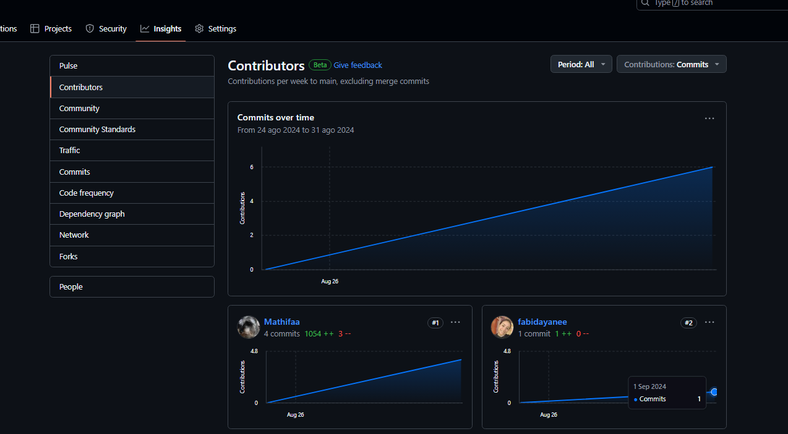
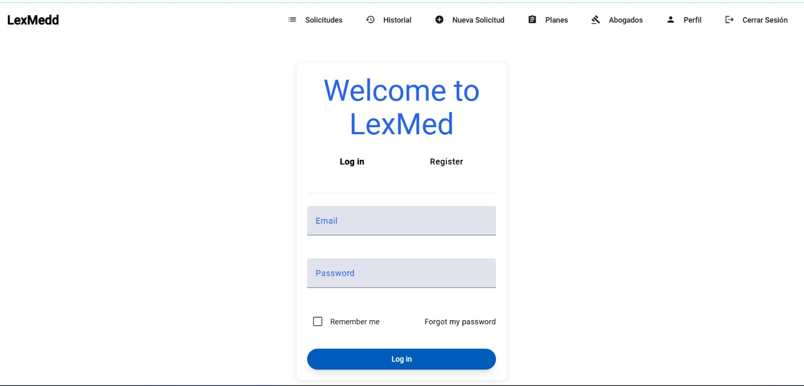
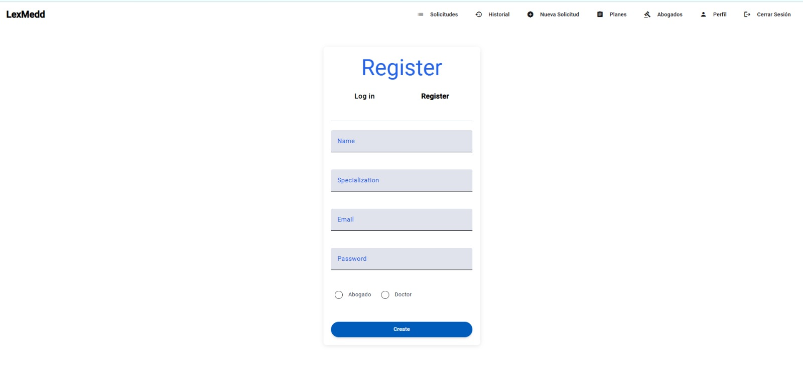
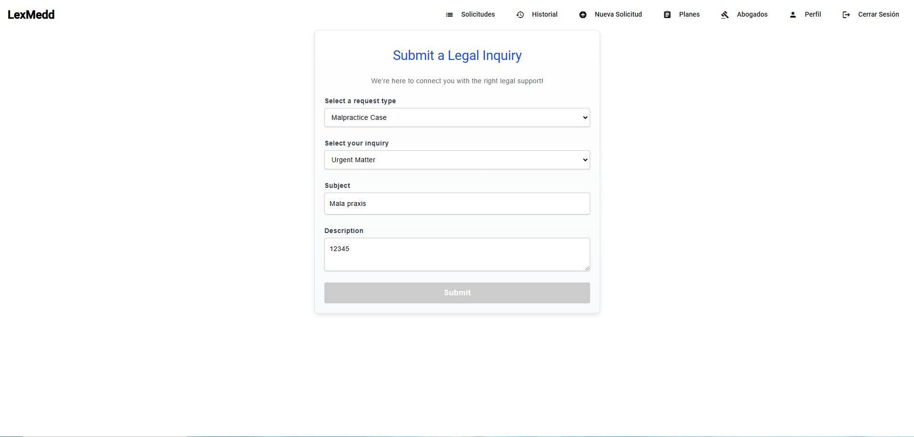
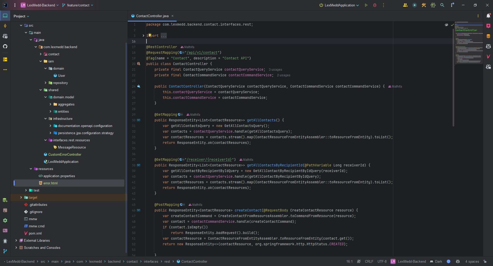

# Capítulo V Product Implementation, Validation & Deployment

### 5.1. Software Configuration Management

### 5.1.1. Software Development Environment Configuration

<strong>Requirements Management</strong> 

- Trello: Esta herramienta es utilizada para gestionar el flujo de trabajo de proyectos, especialmente aquellos basados en la metodología "Agile". La utilizaremos para visualizar y actualizar el estado de las tareas e historias de usuario queforman parte del sprint en desarrollo. Ruta de referencia:  https://trello.com/es

<strong>Product UX/UI Design</strong>
<ol>
  <li>Figma: Esta plataforma sirve para la creación de prototipos y la edición gráfica, utilizada principalmente en el diseñodigital. En este proyecto, se empleará para el prototipado de la aplicación, tanto en sus versiones 
para escritorio como para navegadores web móviles. Ruta de referencia: https://www.figma.com/login2 </li>
  <li>Lucidchart: Plataforma para diagramar flujos. Será utilizada para el diiseño de wireflows, user-flows y los diagramasde clases de nuestro proyecto. Ruta de referencia: https://www.lucidchart.com</li>
</ol>

<strong>Software Testing</strong>

- Gherkin: Sistema de etiquetado especial empleado para describir los criterios de aceptación de cada historia de usuario. Ruta de referencia: https://cucumber.io/docs/gherkin/

<strong>Software Development</strong>
<ol>
  <li>WebStorm es el entorno de desarrollo integrado (IDE) seleccionado para la creación y compilación del código debido al dominio que los miembros del equipo tienen sobre esta herramienta. Su uso aporta valor al 
proyecto, ya que permite agregar extensiones útiles, ofrece soporte para la edición de texto en múltiples lenguajes de programación, y está disponible en varios sistemas operativos, entre otras ventajas. Para más 
detalles, consulta la referencia: https://www.jetbrains.com/webstorm/.</li>
 
  <li>HTML5: HyperText Markup Language, o por sus siglas HTML, es un lenguaje de etiquetado para páginas web. Será empleado en eldesarrollo del proyecto para la presentación del contenido en la aplicación. Ruta de referencia https://www.w3schools.com/html/html5_syntax.asp</li>
 
  <li>CSS, o Cascading Style Sheets, es un lenguaje utilizado para gestionar el diseño y la presentación de las páginas web, complementando el uso de HTML. Para más información, consulta la referencia: https://google.github.io/styleguide/htmlcssguide.html.</li>
 
  <li>JavaScript es un lenguaje de programación interpretado y orientado a objetos. Se empleará para desarrollar la interfaz de usuario dentro de la aplicación. Puedes consultar más detalles en la referencia: https://developer.mozilla.org/es/docs/Web/JavaScript.</li>
 
  <li>C# es un lenguaje de programación orientado a objetos y desarrollado por Microsoft. Se utilizará en el proyecto para la creación de la lógica del servidor y el desarrollo de componentes backend. Este lenguaje es conocido por su robustez y capacidad para manejar 
aplicaciones de gran escala, siendo una elección ideal para desarrollar soluciones empresariales. Para más información, visita la referencia: https://learn.microsoft.com/es-es/dotnet/csharp/.</li>
 
</ol>

<strong>Software Deployment</strong>

- Git: Herramienta de control de versiones que permite registrar y gestionar las diferentes versiones del programa. Se utilizará para mantener un historial de cambios y simplificar la corrección de errores. 
Los miembros del equipo accederán a través de la línea de comandos en sus sistemas locales. Ruta de referencia:https://git-scm.com/ 

<strong>Software Documentation and Project Management</strong>

- GitHub: Plataforma basada en la nube que alojará los repositorios de código del proyecto. Facilitará la colaboración en tiempo real y la revisión de contribuciones de cada miembro del equipo. Los miembros  del equipo accederán a través de sus navegadores web. Ruta de referencia: https://github.com/

### 5.1.2. Source Code Management

Nuestro proyecto seguirá los lineamientos del modelo GitFlow para controlar las versiones, donde utilizaremos GitHub como plataforma y sistema para el control de dichas versiones. Links del repositorio de GitHub:

- Link de la organización: https://github.com/LexMedd
- Repositorio landing page: https://github.com/LexMedd/Landing-Page
- Link del informe del proyecto: https://github.com/LexMedd/Informe-TF

**Estructura de las ramas:**

- Main Branch: Rama principal de la aplicación. Se encuentran las versiones más actualizadas y estables de desarrollo, por medio de un proceso de admisión se agregan cambios de otras ramas derivadas.
- Develop Branch: Esta rama es donde se reunen de las demás ramas los avances del proyecto y desarollo. Se evalúan todos los cambios para ser registradas posteriormente en nuestra rama main.
- Chapter-01 Branch: En esta rama se actualizará toda la información y documentación del capítulo 1 del producto presentado.
- Chapter-02 Branch: En esta rama se actualizará toda la información y documentación del capítulo 2 del producto presentado.
- Chapter-03 Branch: En esta rama se actualizará toda la información y documentación del capítulo 3 del producto presentado.
- Chapter-04 Branch: En esta rama se actualizará toda la información y documentación del capítulo 4 del producto presentado.
- Chapter-05 Branch: En esta rama se actualizará toda la información y documentación del capítulo 5 del producto presentado.
  
**Commit Conventions**
Para los commits en Github se han utilizado los estándares convencionales versión 1.1.0 (https://www.conventionalcommits.org/en/v1.0.0/) según la estructura:
<type>[optional scope]: <description>
●	Type: representa el tipo de commit, sea tipo feature (feat), fix (fix) o docs (docs).
●	Optional scope: es opcional y representa el alcance del commit.
●	Description: descripción detallada del commit y acciones realizadas.

**Semantic Versioning**
Los releases se realizan según los estándares de Semantinc Versioning 2.0 (https://semver.org/), según el formato MAJOR.MINOR.PATCH.
●	MAJOR: versión mayor cuando se implementa cambios de APIs incompatibles.
●	MINOR: versión menor cuando se añaden features y funcionalidades nuevas.
●	PATCH versión de parche de bug fixes y hotfixes.

### 5.1.3 Source Code Style Guide & Conventions

**HTML: Mejores prácticas seguidas**

- Utilizamos elementos HTML con un significado claro y preciso para el contenido marcado, como `header`, `nav`, `main`, `article`, `section`, `aside`, `footer`, entre otros, al estructurar la landing page. Esto evita redundancias y el uso incorrecto de elementos.
- Aunque HTML5 permite algunas etiquetas auto-cerradas (como `img` e `input`), seguimos la práctica de cerrar todas las etiquetas correctamente para prevenir problemas de renderizado. Por ejemplo: `
 Hola! Somos LexMed!.
`
- Para mejorar la accesibilidad, siempre incluimos el atributo `alt` en las etiquetas `img` para describir brevemente el contenido de la imagen. Por ejemplo: ``
- Aunque HTML permite el uso de mayúsculas y minúsculas en nombres de elementos y atributos, utilizamos solo minúsculas para mantener el orden y mejorar la legibilidad del código.
- No omitimos etiquetas principales e importantes como `<html>`, `<body>`, `<header>`, entre otras.
- Escribimos los comentarios cortos en una sola línea.

**CSS: Buenas prácticas**

- Los nombres de clases son claros, precisos y autodescriptivos.
- Separamos los nombres de clases e IDs con guiones, por ejemplo: `#userWorker-id` o `button-shape{}`.
- Utilizamos comentarios claros para explicar el código.
- Aplicamos sangría a todo el contenido dentro de un bloque.
- Separar declaraciones y selectores en nuevas líneas para mantener una buena legibilidad y orden.

**JavaScript: Principales buenas prácticas**

- Empleamos la nomenclatura camelCase para nombrar variables y funciones, por ejemplo, `miVariable` o `miFuncion`.
- Usamos PascalCase para nombrar clases y constructores, por ejemplo, `MiClase`.
- Evitamos nombres de variables genéricos o ambiguos.
- Incluimos comentarios generales para explicar el propósito y la funcionalidad del código.
- Usamos punto y coma al final de cada declaración.
- Mantenemos consistencia en el uso de comillas simples (`''`) o dobles (`""`) para cadenas de texto.
- Aplicamos operadores ternarios de manera cuidadosa para asegurar la legibilidad, por ejemplo, `(condición ? resultadoTrue : resultadoFalse)`.
- Evitamos y eliminamos el uso de funciones obsoletas.
- Utilizamos `try-catch` para manejar y gestionar errores.
- Organizamos el código en bloques lógicos separados por líneas en blanco para mejorar la legibilidad.

**Gherkin:**

- Gherkin es un lenguaje de dominio especializado usado en el desarrollo guiado por comportamiento (BDD), diseñado para mejorar la comunicación entre equipos de negocios y técnicos al abordar problemas específicos. Utiliza saltos de línea y palabras clave como "Given", "When", "Then" y "And" para mejorar la legibilidad y organización de los escenarios en BDD, facilitando una estructura clara y efectiva de diferentes tipos de casos.

### 5.1.4 Software Deployment Configuration

#### Landing Page Deployment

Para desplegar la landing page de BiciBreeze resultó necesario cumplir una serie de requisitos, entre ellos, es necesario contar con una cuenta personal, una organización y un repositorio al cual cargar los documentos (se utilizará la plataforma Github Pages y Github Actions, para la implementación y despegue). Cumplido lo anterior, será posible comenzar el despliegue de la landing page. Estos son los pasos a seguir:

<ol>
  <li>Crear una carpeta Docs para alojar el landing page y especificar en Github Pages como fuente de la página.
  </li>
  <li>Asegurarse de que los archivos sigan los terminales correctos "index.html", para la landing page; "style.css" para los estilos y una carpeta "img" que contendrá las imágenes.
  </li>
  <li>Cargar los archivos mediante un push a la rama main del repositorio.</li>
  <li>Verificar que se haya desplegado correctamente.</li>

 

**Link del deploy de landing page:** https://lexmedd.github.io/Landing-Page/

## 5.2 Landing Page, Services & Applications Implementation

### 5.2.1 Sprint 1

#### 5.2.1.1 Sprint Planning 1

Para este primer sprint nos enfocaremos en los tasks para la
elaboración de la Landing Page. Nos dividiremos entre nosotros cada
una de las tareas identificadas para el sprint.
<table>
<tr>
    <th colspan="5">Sprint #</th>
    <th colspan="9">Sprint 1</th>
  </tr>
      <tr>
    <td colspan="13">Sprint Planning Background</td>
  </tr>
  <tr>
    <td colspan="5">Date</td>
    <td colspan="8">2024-04-0</td>
</tr>
  <tr>
    <td colspan="5">Time</td>
    <td colspan="8">11:30 PM</td>
  </tr>
  <tr>
    <td colspan="5">Location</td>
    <td colspan="8">Via Discord y Google Meet</td>
<tr>
    <td colspan="5">Prepared By</td>
    <td colspan="8">Augusto Mathias Vasquez Requejo</td>
</tr>
<tr>
    <td colspan="5">Attendees (to planning meeting)</td>
    <td colspan="8">Fabiola Becerra, Arnold Morales, Estrella Ticona, Leonardo Dueñas</td>
</tr>
<tr>
    <td colspan="5">Sprint n – 1 Review Summary</td>
    <td colspan="8">En esta seccion se planteo el desarrollo del landing page para nuestro proyecto llamado LexMedd y la reparticion de partes de caracter individual para esta primera entrega</td>
</tr>
<tr>
    <td colspan="5">Sprint n – 1 Retrospective Summary</td>
    <td colspan="8">En esta seccion todos los integrantes mencionaron tener aciertos en las respectivas partes que le correspondia cada uno para esta primera entrega</td>
</tr>
<tr>
    <td colspan="13">Sprint Goal & User Stories</td>
</tr>
<tr>
    <td colspan="5">Sprint n Goal</td>
    <td colspan="8">Culminar el landing Page e Informe</td>
</tr>
<tr>
    <td colspan="5">Sprint n Velocity</td>
    <td colspan="8">6 story points</td>
</tr>
<tr>
    <td colspan="5">Sum of Story Points</td>
    <td colspan="8">9 Story Points</td>
</tr>
</table>

#### 5.2.1.2 Sprint Backlog 1

<table>
<tr>
    <th colspan="3">Sprint #</th>
    <th colspan="10">Sprint 1</th>
  </tr>
      <tr>
    <td colspan="3">User Story</td>
    <td colspan="10">Work-Item/Task</td>
  </tr>
  <tr>
    <td colspan="1">Id</td>
    <td colspan="2">Title</td>
    <td colspan="1">Id</td>
    <td colspan="2">Title</td>
    <td colspan="3">Description</td>
    <td colspan="1"> Estimation</td>
    <td colspan="2">Assigned To</td>
    <td colspan="1">Status(To-do /InProcess /To-Review /Done)</td>
</tr>
  <tr>
    <td colspan="1">5</td>
    <td colspan="2">Visualización de lista de tipos de suscripción</td>
    <td colspan="1">1</td>
    <td colspan="2">Añadir funcion para mostrar lista de tipos de suscrpción</td>
    <td colspan="3">Como visitador de la landing page de LexMed,quiero visitar la lista de tipos de suscripción para seleccionar alguno.</td>
    <td colspan="1">1</td>
    <td colspan="2">Mathias</td>
    <td colspan="1">Done</td>
  </tr>
  <tr>
    <td colspan="1">16</td>
    <td colspan="2">Sección de Creadores</td>
    <td colspan="1">2</td>
    <td colspan="2">Añadir funcion para mostrar los creadores de la empresa</td>
    <td colspan="3">Como visitador de la landing page de LexMed, quiero ver una sección de creadores para facilitar tener el conocimiento de los creadores de la empresa.</td>
    <td colspan="1">1</td>
    <td colspan="2">Mathias</td>
    <td colspan="1">Done</td>
<tr>
    <td colspan="1">13</td>
    <td colspan="2">Visualización de servicios</td>
    <td colspan="1">3</td>
    <td colspan="2">Añadir sección de servicios</td>
    <td colspan="3">Como visitador de la landing page de LexMed, quiero ver una sección donde se expliquen los servicios para estar mejor informado a la hora de confiar en su servicio.</td>
    <td colspan="1">1</td>
    <td colspan="2">Mathias</td>
    <td colspan="1">Done</td>
</tr>
<tr>
    <td colspan="1">14</td>
    <td colspan="2">Sección de contacto us</td>
    <td colspan="1">4</td>
    <td colspan="2">Añadir sección de contacto</td>
    <td colspan="3">Como visitador de la landing page de LexMed, quiero ver una sección de contacto para facilitar la comunicación al momento de solicitar el servicio.</td>
    <td colspan="1">1</td>
    <td colspan="2">Mathias</td>
    <td colspan="1">Done</td>
</tr>
<tr>
    <td colspan="1">15</td>
    <td colspan="2">Sección about us</td>
    <td colspan="1">5</td>
    <td colspan="2">Añadir sección nosotros</td>
    <td colspan="3">Como visitador de la landing page de LexMed, quiero ver una sección nosotros para informarme sobre la empresa que está brindando los servicios.</td>
    <td colspan="1">1</td>
    <td colspan="2">Mathias</td>
    <td colspan="1">Done</td>
</tr>
<tr>
    <td colspan="1">16</td>
    <td colspan="2">Sección de inicio</td>
    <td colspan="1">6</td>
    <td colspan="2">Añadir sección de inicio</td>
    <td colspan="3">Como visitador de la landing page de LexMed, quiero ver una sección de inicio con una barra de navegación para poder desplazarme mejor por la landing page.</td>
    <td colspan="1">1</td>
    <td colspan="2">Mathias</td>
    <td colspan="1">Done</td>
</tr>
</table>

### 5.2.1.3. Development Evidence for Sprint Review

<table>
    <tr>
        <th colspan="2">Repository</th>
        <th colspan="2">Branch</th>
        <th colspan="2">Commit Id</th>
        <th colspan="2">Commit Message</th>
        <th colspan="2">Commit Message Body</th>
        <th colspan="2">Commited on (Date)</th>
    </tr>
        <tr>
        <td colspan="2">LexMedd/Landing-Page</td>
        <td colspan="2">Main</td>
        <td colspan="2">c34065a</td>
        <td colspan="2">Initial commit</td>
        <td colspan="2">-</td>
        <td colspan="2">02/09/2024</td>
    </tr>
        <tr>
        <td colspan="2">LexMedd/Landing-Page</td>
        <td colspan="2">Main</td>
        <td colspan="2">c88105d</td>
        <td colspan="2">landing page created but needs changes</td>
        <td colspan="2">-</td>
        <td colspan="2">03/09/2024</td>
    </tr>
     <tr>
        <td colspan="2">LexMedd/Landing-Page</td>
        <td colspan="2">Main</td>
        <td colspan="2">c7bca44</td>
        <td colspan="2">update readme lexmed landing page</td>
        <td colspan="2">-</td>
        <td colspan="2">03/09/2024</td>
    </tr>
    <tr>
        <td colspan="2">LexMedd/Landing-Page</td>
        <td colspan="2">Main</td>
        <td colspan="2">d658fb5</td>
        <td colspan="2">update json need fix</td>
        <td colspan="2">-</td>
        <td colspan="2">05/09/2024</td>
    </tr>
    <tr>
        <td colspan="2">LexMedd/Landing-Page</td>
        <td colspan="2">Main</td>
        <td colspan="2">2e9d92d</td>
        <td colspan="2">Feat: Design landing page structure and overall styles.</td>
        <td colspan="2">-</td>
        <td colspan="2">05/09/2024</td>
    </tr>
    <tr>
        <td colspan="2">LexMedd/Landing-Page</td>
        <td colspan="2">Main</td>
        <td colspan="2">7896294</td>
        <td colspan="2">feat: needs images</td>
        <td colspan="2">-</td>
        <td colspan="2">06/09/2024</td>
    </tr>
</table>

### 5.2.1.4. Testing Suite Evidence for Sprint Review

**Unit Tests**

Test de visualización de lista de tipos de suscripción

- Clase relacionada: SubscriptionService

- Comportamiento: Verificar que la función para mostrar la lista de tipos de suscripción funciona correctamente.

Test de visualización de servicios

- Clase relacionada: ServiceController

- Comportamiento: Verificar que la sección de servicios se muestra correctamente en la página principal.

Test de visualización de sección de contacto

- Clase relacionada: ContactController

- Comportamiento: Verificar que la sección de contacto se muestra correctamente en la página principal.

Test de visualización de sección de inicio

- Clase relacionada: NavigationController

- Comportamiento: Verificar que la barra de navegación se muestra correctamente en la página principal.

<table>
  <thead>
    <tr>
      <th>Repository</th>
      <th>Branch</th>
      <th>Commit Id</th>
      <th>Commit Message</th>
      <th>Commit Message Body</th>
      <th>Committed on (Date)</th>
    </tr>
  </thead>
  <tbody>
    <tr>
      <td>LexMedd/Landing-Page</td>
      <td>main</td>
      <td>c34065a900719de67f9e1def72de6dd43c2b63cd</td>
      <td>initial commit</td>
      <td>- Created initial commit for landing page</td>
      <td>2024-09-02</td>
    </tr>
    <tr>
      <td>LexMedd/Landing-Page</td>
      <td>main</td>
      <td>c88105d63e17d12eb471134118e94b00dcfa5935</td>
      <td>Added all the sections of the landing page</td>
      <td>- created all the sections of landing page</td>
      <td>2024-09-03</td>
    </tr>
    <tr>
      <td>LexMedd/Landing-Page</td>
      <td>main</td>
      <td>c7bca44b4409716130fc599299342e78b066d529</td>
      <td>update readme lexmed landing page</td>
      <td>- updated readme of the landing page</td>
      <td>2024-09-03</td>
    </tr>
    <tr>
      <td>LexMedd/Landing-Page</td>
      <td>main</td>
      <td>d658fb5445d37fb0aa11dd55085e9997395fc40a</td>
      <td>update json need fix</td>
      <td>- update json and fix for the landing page</td>
      <td>2024-09-05</td>
    </tr>
    <tr>
      <td>LexMedd/Landing-Page</td>
      <td>main</td>
      <td>2e9d92da14b675f17a2c579719ed80d98bb39d96</td>
      <td>Feat: Design landing page structure and overall styles.</td>
      <td>- desing landing page structure</td>
      <td>2024-09-05</td>
    </tr>
    <tr>
      <td>LexMedd/Landing-Page</td>
      <td>main</td>
      <td>789629424b2a981f496b5aa25f09a5412348c7bb</td>
      <td>needs images</td>
      <td>- the landing page needs images in the correct places</td>
      <td>2024-09-06</td>
    </tr>
    <tr>
  </tbody>
</table>

### 5.2.1.5. Execution Evidence for Sprint Review

Para esta primera entrega, nuestro equipo a conseguido elaborar la Landing Page del proyecto "LexMed". De tal modo, se podrá visualizar la información necesaria de lo que ofrece nuestro proyecto.

**Sección de inicio**: Se implementó el Header de nuestra Landing Page.

**Sección de Nosotros**: Se implementó la sección de nosotros para describir un poco sobre quienes somos.

**Sección de Servicios**: Se implementó la sección de los servicios ofrecidos.

**Sección de Planes**: Se implementó la sección de ver los tipos de suscripción.
 
**Sección de contacto y creadores**: Se añadió la sección de contacto para facilitar la comunicación con los usuarios y la información de los creadores.

### 5.2.1.6. Services Documentation Evidence for Sprint Review

En este sprint solo se trabajó el landing page.

### 5.2.1.7. Software Deployment Evidence for Sprint Review

Para el despliegue del Landing Page, hemos utilizado la herramienta de Github Pages para poder hacer un deployment. Para eso, hemos creado un repositorio donde hemos colocado el código de desarrollo de nuestra Landing Page.

Una vez creado el repositorio, entraremos a configuración del repositorio y escogemos el apartado de Pages. Se coloca la información necesaria, como la fuente del branch a utilizar para realizar el deployment. Luego de eso, Github Pages nos brindará el link y desplegará nuestra landing page en la Web.

### 5.2.1.8. Team Collaboration Insights during Sprint

Para el desarrollo de este primer sprint, todos los miembros del equipo desarrollaron y colaboraron de manera activa y continua. De tal modo, se muestra como evidencia los insights de cada miembro del equipo.

Commits:

Analiticas de Colaboración:

### 5.2.1 Sprint 2

#### 5.2.1.1 Sprint Planning 2

Para este segundo sprint nos enfocaremos en los tasks para la
elaboración de la Landing Page. Nos dividiremos entre nosotros cada
una de las tareas identificadas para el sprint.
<table>
<tr>
    <th colspan="5">Sprint #</th>
    <th colspan="9">Sprint 2</th>
  </tr>
      <tr>
    <td colspan="13">Sprint Planning Background</td>
  </tr>
  <tr>
    <td colspan="5">Date</td>
    <td colspan="8">2024-04-17</td>
</tr>
  <tr>
    <td colspan="5">Time</td>
    <td colspan="8">19:00 PM</td>
  </tr>
  <tr>
    <td colspan="5">Location</td>
    <td colspan="8">Google Meet</td>
<tr>
    <td colspan="5">Prepared By</td>
    <td colspan="8">Augusto Mathias Vasquez Requejo</td>
</tr>
<tr>
    <td colspan="5">Attendees (to planning meeting)</td>
    <td colspan="8">Leonardo Dueñas</td>
</tr>
<tr>
    <td colspan="5">Sprint n – 2 Review Summary</td>
    <td colspan="8">En esta reunion se planteo el desarrollo del Frontend para nuestro proyecto llamado LexMedd y la reparticion de partes de caracter indiviudal o en pareja para esta segunda entrega</td>
</tr>
<tr>
    <td colspan="5">Sprint n – 2 Retrospective Summary</td>
    <td colspan="8">En esta seccion todos los integrantes mencionaron tener aciertos en las respectivas partes que le correspondia cada uno para esta primera entrega</td>
</tr>
<tr>
    <td colspan="13">Sprint Goal & User Stories</td>
</tr>
<tr>
    <td colspan="5">Sprint n Goal</td>
    <td colspan="8">Avanzar el Frontend</td>
</tr>
<tr>
    <td colspan="5">Sprint n Velocity</td>
    <td colspan="8"> 15 story points</td>
</tr>
<tr>
    <td colspan="5">Sum of Story Points</td>
    <td colspan="8"> 20 Story Points</td>
</tr>
</table>

#### 5.2.1.2 Sprint Backlog 2

<table>
<tr>
    <th colspan="3">Sprint #</th>
    <th colspan="10">Sprint 2</th>
  </tr>
      <tr>
    <td colspan="3">User Story</td>
    <td colspan="10">Work-Item/Task</td>
  </tr>
  <tr>
    <td colspan="1">Id</td>
    <td colspan="2">Title</td>
    <td colspan="1">Id</td>
    <td colspan="2">Title</td>
    <td colspan="3">Description</td>
    <td colspan="1"> Estimation</td>
    <td colspan="2">Assigned To</td>
    <td colspan="1">Status(To-do /InProcess /To-Review /Done)</td>
</tr>
  <tr>
    <td colspan="1">9</td>
    <td colspan="2">Actualización de Datos de Perfil</td>
    <td colspan="1">1</td>
    <td colspan="2">Añadir funcion para editar datos del perfil del usuario</td>
    <td colspan="3">Como usuario, quiero actualizar mi información de perfil para mantener mis datos personales siempre actualizados.</td>
    <td colspan="1">5</td>
    <td colspan="2">Arnold</td>
    <td colspan="1">Done</td>
  </tr>
  <tr>
    <td colspan="1">6</td>
    <td colspan="2">Redirección Rápida desde la Landing Page</td>
    <td colspan="1">2</td>
    <td colspan="2">Añadir funcion de redireccion desde landing page hasta aplicacion web.</td>
    <td colspan="3">Como visitante de la landing page, quiero componentes interactivos que me redirijan fácilmente a diferentes secciones de la plataforma.</td>
    <td colspan="1">1</td>
    <td colspan="2">Estrella</td>
    <td colspan="1">To-do</td>
<tr>
<tr>
    <td colspan="1">7</td>
    <td colspan="2">Visualización y Organización de Casos para Abogados</td>
    <td colspan="1">4</td>
    <td colspan="2">Organizacion visual de casos para la vista de abogados</td>
    <td colspan="3">Como abogado, quiero un sistema que me permita visualizar y organizar de manera clara los casos de mala praxis o asesoría legal para gestionarlos de manera eficiente.</td>
    <td colspan="1">3</td>
    <td colspan="2">Fabiola</td>
    <td colspan="1">In-Process</td>
</tr>
<tr>
    <td colspan="1">TS11</td>
    <td colspan="2">Gestión de Solicitudes</td>
    <td colspan="1">5</td>
    <td colspan="2">Gestión de Solicitudes, creacion, aceptacion o rechazo</td>
    <td colspan="3">Como desarrollador de LexMed, quiero implementar la gestión de solicitudes en la seccion llamada "Contact"</td>
    <td colspan="1">3</td>
    <td colspan="2">Augusto Mathias</td>
    <td colspan="1">Done</td>
</tr>
</table>

### 5.2.1.3. Development Evidence for Sprint Review

<table>
    <tr>
        <th colspan="2">Repository</th>
        <th colspan="2">Branch</th>
        <th colspan="2">Commit Id</th>
        <th colspan="2">Commit Message</th>
        <th colspan="2">Commit Message Body</th>
        <th colspan="2">Commited on (Date)</th>
    </tr>
        <tr>
        <td colspan="2">LexMedd/Frontend</td>
        <td colspan="2">Develop</td>
        <td colspan="2">add message bc</td>
        <td colspan="2">add message bounded context</td>
        <td colspan="2">-</td>
        <td colspan="2">/09/2024</td>
    </tr>
        <tr>
        <td colspan="2">LexMedd/Frontend</td>
        <td colspan="2">Develop</td>
        <td colspan="2">add service message and user</td>
        <td colspan="2">add service message and user in bc</td>
        <td colspan="2">-</td>
        <td colspan="2">/09/2024</td>
    </tr>
</table>

### 5.2.2.5. Execution Evidence for Sprint Review

Para esta segunda entrega, nuestro equipo no consiguio elaborar la primera version de Frontend Web Application del proyecto "LexMedd". De tal modo, se podrá visualizar la información necesaria de lo que ofrece nuestro proyecto.

**Sección de Login and Register**: Se implementó la seccion de login and register.
 

**Sección de Contact and Request services**: Se implementó la seccion de request.

### 5.2.2.6. Services Documentation Evidence for Sprint Review

Durante este sprint, se ha desarrollado una Fake API de abogados que proporciona información sobre abogados ficticios. La API incluye detalles como el guardar datos.

Url del repositorio: https://github.com/LexMedd/LexMedd-Frontend

### 5.2.2.7. Software Deployment Evidence for Sprint Review
Para el despliegue de la primera version del Frontend Web Application hemos utilizado la plataforma de terceros llamada Netlify. Esta plataforma nos permite el facil acceso a nuestro repositorio de Github, el cual por medio de ciertas configuraciones podemos tener como resultado el despliegue de nuestra primera version del Frontend Web Application.

Url de nuestro Frontend desplegado: https://6725489fef0e06af8a3d6b32--lexmeddwebapp.netlify.app/login  

### 5.2.2.8. Team Collaboration Insights during Sprint

Para el desarrollo de este segundo sprint, todos los miembros del equipo desarrollaron y colaboraron de manera activa y continua. De tal modo, se muestra como evidencia los insights de cada miembro del equipo.

Commits:

Network Graph:

### 5.2.3. Sprint 3

### 5.2.3.1. Sprint Planning 3

<table>
<tr>
    <th colspan="5">Sprint #</th>
    <th colspan="9">Sprint 3</th>
  </tr>
      <tr>
    <td colspan="13">Sprint Planning Background</td>
  </tr>
  <tr>
    <td colspan="5">Date</td>
    <td colspan="8">2024-10-30</td>
</tr>
  <tr>
    <td colspan="5">Time</td>
    <td colspan="8">4:20 PM</td>
  </tr>
  <tr>
    <td colspan="5">Location</td>
    <td colspan="8">Via Discord y Google Meet</td>
<tr>
    <td colspan="5">Prepared By</td>
    <td colspan="8">Augusto Vasquez</td>
</tr>
<tr>
    <td colspan="5">Attendees (to planning meeting)</td>
    <td colspan="8">Augusto Vasquez, Leonardo Dueñas, Arnold Morales, Estrella Ticona.</td>
</tr>
<tr>
    <td colspan="5">Sprint n – 3 Review Summary</td>
    <td colspan="8">En esta seccion se planteo el desarrollo de los Web Services para nuestro proyecto llamado LexMedd</td>
</tr>
<tr>
    <td colspan="5">Sprint n – 3 Retrospective Summary</td>
    <td colspan="8">En esta seccion todos los integrantes mencionaron tener aciertos en algunas partes del codigo desarrollado. Sin embargo, se pudo hacer un concenso, y a la vez, mejoramos nuestras habilidades realizando el Web Services</td>
</tr>
<tr>
    <td colspan="13">Sprint Goal & User Stories</td>
</tr>
<tr>
    <td colspan="5">Sprint n Goal</td>
    <td colspan="8">Desplegar la primera version de Web Services.</td>
</tr>
<tr>
    <td colspan="5">Sprint n Velocity</td>
    <td colspan="8">5 story points</td>
</tr>
<tr>
    <td colspan="5">Sum of Story Points</td>
    <td colspan="8">5 Story Points</td>
</tr>
</table>

### 5.2.1.2. Sprint Backlog 3

<table>
<tr>
    <th colspan="3">Sprint #</th>
    <th colspan="10">Sprint 3</th>
  </tr>
      <tr>
    <td colspan="3">User Story</td>
    <td colspan="10">Work-Item/Task</td>
  </tr>
  <tr>
    <td colspan="1">Id</td>
    <td colspan="2">Title</td>
    <td colspan="1">Id</td>
    <td colspan="2">Title</td>
    <td colspan="3">Description</td>
    <td colspan="1"> Estimation</td>
    <td colspan="2">Assigned To</td>
    <td colspan="1">Status(To-do /InProcess /To-Review /Done)</td>
</tr>
  <tr>
    <td colspan="1">46</td>
    <td colspan="2">Creación y gestión de recursos de casos legales</td>
    <td colspan="1">1</td>
    <td colspan="2">Creación y gestión de solicitudes</td>
    <td colspan="3">Como desarrollador backend, quiero implementar la creación y gestión de solicitudes, asi como su creacion y su eliminacion.</td>
    <td colspan="1">5</td>
    <td colspan="2">Augusto Mathias</td>
    <td colspan="1">Done</td>
  </tr>
</table>

### 5.2.3.3. Development Evidence for Sprint Review

<table>
  <thead>
    <tr>
      <th>Repository</th>
      <th>Branch</th>
      <th>Commit Id</th>
      <th>Commit Message</th>
      <th>Commit Message Body</th>
      <th>Committed on (Date)</th>
    </tr>
  </thead>
  <tbody>
    <tr>
      <td>LexMedd/Backend-LexMedd</td>
      <td>Augusto Mathias Leonardo Vasquez Requejo</td>
      <td>ef480ccd255b89447523f90e8efc7a947a490001</td>
      <td>Merge Bounded Context of Contact</td>
      <td>-</td>
      <td>01/11/2024</td>
  </tbody>
</table>

### 5.2.3.4. Testing Suite Evidence for Sprint Review

<table>
  <thead>
    <tr>
      <th>Repository</th>
      <th>Branch</th>
      <th>Commit Id</th>
      <th>Commit Message</th>
      <th>Commit Message Body</th>
      <th>Committed on (Date)</th>
    </tr>
  </thead>
  <tbody>
    <tr>
      <td>LexMedd/Backend-LexMedd</td>
      <td>Augusto Mathias Leonardo Vasquez Requejo </td>
      <td>ef480ccd255b89447523f90e8efc7a947a490001</td>
      <td>Merge Bounded Context of Contact</td>
      <td>-</td>
      <td>01/11/2024</td>
    </tr>
    <tr>
  </tbody>
</table>

### 5.2.3.5. Execution Evidence for Sprint Review
Para esta tercera entrega, nuestro equipo a conseguido elaborar la primera versión del Web Services del proyecto "LexMedd". El cual utilizamos la plataforma "Swagger" para poder visualizar los endpoints realizados.

### 5.2.3.6. Services Documentation Evidence for Sprint Review

Durante este sprint, se ha desarrollado el back-end de una API de abogados utilizando Java, JPA (Java Persistence API), y siguiendo los principios de Domain-Driven Design (DDD). La API proporciona información sobre usuarios.

<table>
  <tr>
    <th>Endpoint</th>
    <th>Acción</th>
    <th>Verbo HTTP</th>
    <th>Sintaxis de Llamada</th>
    <th>Parámetros</th>
    <th>Ejemplo de Llamada</th>
    <th>Explicación del Response</th>
  </tr>
  <tr>
    <td>/api/v1/lawyers</td>
    <td>Listar</td>
    <td>GET</td>
    <td>/api/lawyers</td>
    <td>-</td>
    <td>GET /api/lawyers</td>
    <td>200 OK: Devuelve una lista de todos los abogados.</td>
  </tr>
  <tr>
    <td>/api/v1/lawyers/{id}</td>
    <td>Obtener</td>
    <td>GET</td>
    <td>/api/lawyers/{id}</td>
    <td>ID del abogado</td>
    <td>GET /api/lawyers/1</td>
    <td>200 OK: Devuelve los detalles del abogado con el ID especificado.</td>
  </tr>
</table>

Capturas de interaccion:

- Controller del bounded context contact

Commits relacionados: 

<table>
    <tr>
        <th colspan="2">Repository</th>
        <th colspan="2">Branch</th>
        <th colspan="2">Commit Id</th>
        <th colspan="2">Commit Message</th>
    </tr>
        <tr>
        <td colspan="2">LexMedd/backend-LexMedd-</td>
        <td colspan="2">Contact</td>
        <td colspan="2">0e0193be5232f042715cc88eae6e6d2fcd00be26</td>
        <td colspan="2">feat : add controller contact</td>
    </tr>
</table>    

### 5.2.3.7. Software Deployment Evidence for Sprint Review
Para el desarrollo de la primera version de Web Services, hemos utilizado la plataforma Github para poder almacenar el avance realizado.

### 5.2.3.8. Team Collaboration Insights during Sprint
Para el desarrollo de este tercer sprint, todos los miembros del equipo desarrollaron y colaboraron de manera activa y continua. De tal modo, se muestra como evidencia los insights de cada miembro del equipo.

**Commits:**

### 5.2.4. Sprint 4

### 5.2.4.1. Sprint Planning 4

<table>
<tr>
    <th colspan="5">Sprint #</th>
    <th colspan="9">Sprint 4</th>
  </tr>
      <tr>
    <td colspan="13">Sprint Planning Background</td>
  </tr>
  <tr>
    <td colspan="5">Date</td>
    <td colspan="8">2024-11-12</td>
</tr>
  <tr>
    <td colspan="5">Time</td>
    <td colspan="8">8:30 PM</td>
  </tr>
  <tr>
    <td colspan="5">Location</td>
    <td colspan="8">Via Discord</td>
<tr>
    <td colspan="5">Prepared By</td>
    <td colspan="8">Mathias Vasquez</td>
</tr>
<tr>
    <td colspan="5">Attendees (to planning meeting)</td>
    <td colspan="8">Mathias Vasquez, Leonardo Dueñas</td>
</tr>
<tr>
    <td colspan="5">Sprint n – 4 Review Summary</td>
    <td colspan="8">En esta sección se corrigieron los errores dentro del informe, se mejoró el front y el back para hacer la conexión con la API y el sitio web.</td>
</tr>
<tr>
    <td colspan="5">Sprint n – 4 Retrospective Summary</td>
    <td colspan="8">En esta sección todos los integrantes mencionaron tener aciertos en algunas partes del código desarrollado. Sin embargo, se pudo hacer un consenso y mejorar nuestras habilidades al realizar la conexión con la API y el sitio web.</td>
</tr>
<tr>
    <td colspan="13">Sprint Goal & User Stories</td>
</tr>
<tr>
    <td colspan="5">Sprint n Goal</td>
    <td colspan="8">Corregir errores e implementar la conexión entre el front y el back con la API y el sitio web.</td>
</tr>
<tr>
    <td colspan="5">Sprint n Velocity</td>
    <td colspan="8">25 story points</td>
</tr>
<tr>
    <td colspan="5">Sum of Story Points</td>
    <td colspan="8">15 Story Points</td>
</tr>
</table>

### 5.2.4.2. Sprint Backlog 4

<table>
<tr>
    <th colspan="3">Sprint #</th>
    <th colspan="10">Sprint 4</th>
</tr>
<tr>
    <td colspan="3">User Story</td>
    <td colspan="10">Work-Item/Task</td>
</tr>
<tr>
    <td colspan="1">Id</td>
    <td colspan="2">Title</td>
    <td colspan="1">Id</td>
    <td colspan="2">Title</td>
    <td colspan="3">Description</td>
    <td colspan="1">Estimation</td>
    <td colspan="2">Assigned To</td>
    <td colspan="1">Status (To-do /InProcess /To-Review /Done)</td>
</tr>
<tr>
    <td colspan="1">24</td>
    <td colspan="2">Soporte para múltiples navegadores</td>
    <td colspan="1">1</td>
    <td colspan="2">Soporte para múltiples navegadores</td>
    <td colspan="3">Como desarrollador, quiero garantizar la compatibilidad en múltiples navegadores, para una experiencia de usuario uniforme.</td>
    <td colspan="1">3</td>
    <td colspan="2">Gabriel</td>
    <td colspan="1">Done</td>
</tr>
<tr>
    <td colspan="1">19</td>
    <td colspan="2">Base de datos de usuarios</td>
    <td colspan="1">5</td>
    <td colspan="2">Base de datos de usuarios</td>
    <td colspan="3">Como administrador, quiero implementar una base de datos segura y escalable, para proteger y gestionar eficazmente la información de los usuarios.</td>
    <td colspan="1">5</td>
    <td colspan="2">Diego</td>
    <td colspan="1">Done</td>
</tr>
<tr>
    <td colspan="1">37</td>
    <td colspan="2">Creación y gestión de recursos de consultas</td>
    <td colspan="1">11</td>
    <td colspan="2">Creación y gestión de recursos de consultas</td>
    <td colspan="3">Como desarrollador backend, quiero implementar la creación y gestión de consultas para que los administradores puedan gestionar las consultas necesarias.</td>
    <td colspan="1">5</td>
    <td colspan="2">Fabricio</td>
    <td colspan="1">Done</td>
</tr>
<tr>
    <td colspan="1">01</td>
    <td colspan="2">Gestión de las cuentas de los usuarios</td>
    <td colspan="1">12</td>
    <td colspan="2">Gestión de las cuentas de los usuarios</td>
    <td colspan="3">Como usuario de la plataforma de MedicDefense, quiero tener la capacidad de gestionar mi cuenta personal, para mantener mi información profesional actualizada y asegurar que la experiencia de la plataforma sea lo más relevante y segura posible.</td>
    <td colspan="1">3</td>
    <td colspan="2">Carlos</td>
    <td colspan="1">Done</td>
</tr>
<tr>
    <td colspan="1">31</td>
    <td colspan="2">Implementación de Categorías de Recursos</td>
    <td colspan="1">15</td>
    <td colspan="2">Implementación de Categorías de Recursos</td>
    <td colspan="3">Como desarrollador backend, quiero implementar la funcionalidad para gestionar categorías de los recursos educativos para organizar los recursos de manera eficiente.</td>
    <td colspan="1">3</td>
    <td colspan="2">Anatoly</td>
    <td colspan="1">Done</td>
</tr>
<tr>
    <td colspan="1">32</td>
    <td colspan="2">Funcionalidad de Búsqueda Avanzada de Recursos Educativos</td>
    <td colspan="1">17</td>
    <td colspan="2">Funcionalidad de Búsqueda Avanzada de Recursos Educativos</td>
    <td colspan="3">Como desarrollador backend, quiero implementar una funcionalidad de búsqueda avanzada para que los usuarios puedan buscar recursos educativos por diferentes criterios.</td>
    <td colspan="1">5</td>
    <td colspan="2">Anatoly</td>
    <td colspan="1">Done</td>
</tr>
<tr>
    <td colspan="1">18</td>
    <td colspan="2">Integración de pagos</td>
    <td colspan="1">19</td>
    <td colspan="2">Integración de pagos</td>
    <td colspan="3">Como administrador, quiero integrar un sistema de pagos seguro para gestionar las suscripciones y compras en la plataforma.</td>
    <td colspan="1">8</td>
    <td colspan="2">Mathias</td>
    <td colspan="1">Done</td>
</tr>
</table>

### 5.2.4.3. Development Evidence for Sprint Review

<table>
  <thead>
    <tr>
      <th>Repository</th>
      <th>Branch</th>
      <th>Commit Id</th>
      <th>Commit Message</th>
      <th>Commit Message Body</th>
      <th>Committed on (Date)</th>
    </tr>
  </thead>
  <tbody>
    <tr>
      <td>Open-Source-Grupo-Testigos-de-Jehova/Backend-MedicDefense</td>
      <td>Carlos Avellaneda</td>
      <td>ef480ccd255b89447523f90e8efc7a947a490001</td>
      <td>Merge Bounded Context of Consultation</td>
      <td>-</td>
      <td>05/06/2024</td>
    </tr>
    <tr>
      <td>Open-Source-Grupo-Testigos-de-Jehova/Backend-MedicDefense</td>
      <td>Anatoly Noriega</td>
      <td>b268969f824061e227a7d9c98ed91b53f0b11d66</td>
      <td>Merge Bounded Context of Educational</td>
      <td>-</td>
      <td>05/06/2024</td>
    </tr>
    <tr>
      <td>Open-Source-Grupo-Testigos-de-Jehova/Backend-MedicDefense</td>
      <td>Augusto Vasquez</td>
      <td>6e6603067d73c88a7e96dd0ecec0a71fd2f683aa</td>
      <td>Merge Bounded Context of Payment</td>
      <td>-</td>
      <td>05/06/2024</td>
    </tr>
    <tr>
      <td>Open-Source-Grupo-Testigos-de-Jehova/Backend-MedicDefense</td>
      <td>Diego Flores</td>
      <td>4b47b3d13182b9ad5f00b1eb2603b3e9fb5c3fe1</td>
      <td>Merge Bounded Context of Communication</td>
      <td>-</td>
      <td>05/06/2024</td>
    </tr>
     <tr>
      <td>Open-Source-Grupo-Testigos-de-Jehova/Backend-MedicDefense</td>
      <td>Gabriel Garcia and Fabricio Apaza</td>
      <td>df35dfbd4c1b012e244eb905bb03d8cde62e29f7</td>
      <td>Merge Bounded Context of Legal Case</td>
      <td>-</td>
      <td>05/06/2024</td>
    </tr>
  </tbody>
</table>

### 5.2.4.4. Testing Suite Evidence for Sprint Review

<table>
  <thead>
    <tr>
      <th>Repository</th>
      <th>Branch</th>
      <th>Commit Id</th>
      <th>Commit Message</th>
      <th>Commit Message Body</th>
      <th>Committed on (Date)</th>
    </tr>
  </thead>
  <tbody>
    <tr>
      <td>Open-Source-Grupo-Testigos-de-Jehova/Backend-MedicDefense</td>
      <td>main</td>
      <td>59e769c513a378a4414d879133e867bef833a636</td>
      <td>add "bounded context paymentv"</td>
      <td>created bounded context paymentv to backend</td>
      <td>2024-06-06</td>
    </tr>
    <tr>
      <td>Open-Source-Grupo-Testigos-de-Jehova/Backend-MedicDefense</td>
      <td>main</td>
      <td>92ae3c6157480b0c09b72a35ae45aeabae1d58d1</td>
      <td>Merge branch 'main' into Augusto_Vasquez</td>
      <td>Merge branch 'main' into Augusto_Vasquez in backend</td>
      <td>2024-06-06</td>
    </tr>
    <tr>
      <td>Open-Source-Grupo-Testigos-de-Jehova/Backend-MedicDefense</td>
      <td>main</td>
      <td>4d965678671a66d81506d51ae4b1a610fa4b34b5</td>
      <td>updated application properties adding connection to database from azure</td>
      <td>Added: updated application properties adding connection to database from azure.</td>
      <td>2024-06-22</td>
    </tr>
    <tr>
      <td>Open-Source-Grupo-Testigos-de-Jehova/Backend-MedicDefense</td>
      <td>main</td>
      <td>378b8b5e689a646c8ac8b7c22168967ba509a3b9</td>
      <td>fixed minor errors</td>
      <td>fixed minor errors in connsultation on backend</td>
      <td>2024-06-22</td>
    </tr>
    <tr>
      <td>Open-Source-Grupo-Testigos-de-Jehova/Backend-MedicDefense</td>
      <td>main</td>
      <td>65bb95a2bc2c22263a0af59a452b72a29b4f320b</td>
      <td>Merge remote-tracking branch 'origin/main'</td>
      <td>Merge remote-tracking branch 'origin/main' in backend</td>
      <td>2024-06-22</td>
    </tr>
    <tr>
      <td>Open-Source-Grupo-Testigos-de-Jehova/Backend-MedicDefense</td>
      <td>main</td>
      <td>3123427451ba19f869aa6941f2d89524e12bacca</td>
      <td>fixed minor errors</td>
      <td>fixed minor errors in consultation on backend</td>
      <td>2024-06-22</td>
    </tr>
  </tbody>
</table>

### 5.2.4.5. Execution Evidence for Sprint Review
Para esta cuarta entrega, nuestro equipo ha mejorado y pulido tanto la parte de backend como la de frontend del proyecto "MedicDefense". Además, hemos logrado la conexión entre ambas partes, asegurando una integración fluida y funcional. Esto permite a los usuarios interactuar con las funcionalidades de la plataforma de manera eficiente y coherente.

Endpoints:

Sing-In:

Sing-Up:

Lawyers:

### 5.2.4.6. Services Documentation Evidence for Sprint Review

Durante este sprint, se ha mejorado el back-end y front-end de una API integral utilizando Java, JPA (Java Persistence API) y siguiendo los principios de Domain-Driven Design (DDD). Además, se ha realizado la conexión entre ambos. Esta API proporciona una amplia gama de funcionalidades, incluyendo la gestión de abogados, recursos educativos, pagos, casos legales, consultas, notificaciones, perfiles, especialidades, roles, usuarios y universidades. La información detallada sobre estos elementos se maneja mediante diversos endpoints que permiten operaciones como listar, crear, actualizar y eliminar registros, utilizando la convención de nomenclatura snake_case para los campos. Estas mejoras aseguran una cobertura completa y eficiente de las necesidades del sistema, facilitando tanto la interacción de los usuarios con la plataforma como la gestión interna de los datos.

<table>
  <tr>
    <th>Endpoint</th>
    <th>Acción</th>
    <th>Verbo HTTP</th>
    <th>Sintaxis de Llamada</th>
    <th>Parámetros</th>
    <th>Ejemplo de Llamada</th>
    <th>Explicación del Response</th>
  </tr>
  <tr>
    <td>/api/v1/medic/{recordId}/add-one-to-paid-service</td>
    <td>Añadir servicio pagado</td>
    <td>PUT</td>
    <td>/api/v1/medic/{recordId}/add-one-to-paid-service</td>
    <td>recordId</td>
    <td>PUT /api/v1/medic/1/add-one-to-paid-service</td>
    <td>200 OK: Añade un servicio pagado al registro especificado.</td>
  </tr>
  <tr>
    <td>/api/v1/medic/{recordId}/add-one-to-consultation</td>
    <td>Añadir consulta</td>
    <td>PUT</td>
    <td>/api/v1/medic/{recordId}/add-one-to-consultation</td>
    <td>recordId</td>
    <td>PUT /api/v1/medic/1/add-one-to-consultation</td>
    <td>200 OK: Añade una consulta al registro especificado.</td>
  </tr>
  <tr>
    <td>/api/v1/medic</td>
    <td>Listar</td>
    <td>GET</td>
    <td>/api/v1/medic</td>
    <td>-</td>
    <td>GET /api/v1/medic</td>
    <td>200 OK: Devuelve una lista de todos los médicos.</td>
  </tr>
  <tr>
    <td>/api/v1/medic</td>
    <td>Crear</td>
    <td>POST</td>
    <td>/api/v1/medic</td>
    <td>-</td>
    <td>POST /api/v1/medic</td>
    <td>201 Created: Crea un nuevo médico.</td>
  </tr>
  <tr>
    <td>/api/v1/medic/{userId}/user</td>
    <td>Obtener por usuario</td>
    <td>GET</td>
    <td>/api/v1/medic/{userId}/user</td>
    <td>userId</td>
    <td>GET /api/v1/medic/1/user</td>
    <td>200 OK: Devuelve los detalles del médico para el usuario especificado.</td>
  </tr>
</table>

Capturas de interaccion:

Endpoints:

Sing-In:

Sing-Up:

Lawyers:

Url del repositorio Frontend: https://github.com/LexMedd/LexMedd-Frontend
Url del repositorio Backend: https://github.com/LexMedd/LexMedd-Backend

Commits relacionados: 

<table>
    <tr>
        <th colspan="2">Repository</th>
        <th colspan="2">Branch</th>
        <th colspan="2">Commit Id</th>
        <th colspan="2">Commit Message</th>
    </tr>
        <tr>
        <td colspan="2">Open-Source-Grupo-Testigos-de-Jehova/backend-Medic-Defense</td>
        <td colspan="2">Carlos_Avellaneda</td>
        <td colspan="2">ef480ccd255b89447523f90e8efc7a947a490001</td>
        <td colspan="2">Merge pull request</td>
    </tr>
        <tr>
        <td colspan="2">Open-Source-Grupo-Testigos-de-Jehova/backend-Medic-Defense</td>
        <td colspan="2">Anatoly_noriega</td>
        <td colspan="2">b268969f824061e227a7d9c98ed91b53f0b11d66</td>
        <td colspan="2">Merge pull request</td>
    </tr>
    <tr>
        <td colspan="2">Open-Source-Grupo-Testigos-de-Jehova/backend-Medic-Defense</td>
        <td colspan="2">Augusto_Vasquez</td>
        <td colspan="2">6e6603067d73c88a7e96dd0ecec0a71fd2f683aa</td>
        <td colspan="2">Merge pull request</td>
    </tr>
    <tr>
        <td colspan="2">Open-Source-Grupo-Testigos-de-Jehova/backend-Medic-Defense</td>
        <td colspan="2">Diego_Flores</td>
        <td colspan="2">4b47b3d13182b9ad5f00b1eb2603b3e9fb5c3fe1</td>
        <td colspan="2">Merge pull request</td>
    </tr>
    <tr>
        <td colspan="2">Open-Source-Grupo-Testigos-de-Jehova/backend-Medic-Defense</td>
        <td colspan="2">Gabriel_Garcia-and-Fabricio_Apaza</td>
        <td colspan="2">df35dfbd4c1b012e244eb905bb03d8cde62e29f7</td>
        <td colspan="2">Merge pull request</td>
    </tr>
</table>    

### 5.2.4.7. Software Deployment Evidence for Sprint Review
Para el desarrollo de la segunda version de Web Services y el Frontend Web Application, hemos utilizado la plataforma Github para poder almacenar el avance realizado.

### 5.2.4.8. Team Collaboration Insights during Sprint
Para el desarrollo de este tercer sprint, todos los miembros del equipo desarrollaron y colaboraron de manera activa y continua. De tal modo, se muestra como evidencia los insights de cada miembro del equipo.

**Commits:**

**Analiticas de Colaboración:**

## 5.3 Validation Interviews

### 5.3.1. Diseño de Entrevistas

Para el diseño de entrevistas hemos recopilado informacion y opiniones acerca de nuestra landing page y frontend.

### 5.3.2. Registro de Entrevistas

En el proceso de investigación para nuestro proyecto, se llevaron a cabo entrevistas del público objetivo. Cada entrevista se documentó en video y se registraron los siguientes detalles:

Enlace de la entrevista: https://upcedupe-my.sharepoint.com/:v:/g/personal/u201922146_upc_edu_pe/ET-wXZaUgZ5Bri_hw1N7cTgBe26622tOUkysmrLFjecIRA?e=5WUtQU&nav=eyJyZWZlcnJhbEluZm8iOnsicmVmZXJyYWxBcHAiOiJTdHJlYW1XZWJBcHAiLCJyZWZlcnJhbFZpZXciOiJTaGFyZURpYWxvZy1MaW5rIiwicmVmZXJyYWxBcHBQbGF0Zm9ybSI6IldlYiIsInJlZmVycmFsTW9kZSI6InZpZXcifX0%3D

**Segmento 1: universitarios**

**Nombre y Apellido:** Gabriel Garcia

**Edad:** 21

**Distrito:** Carabayllo

**Screenshot de la Entrevista:**

**Timelapse:** [Inicio: 00:00, Fin: 06:53]

**Segmento 1: universitarios**

**Nombre y Apellido:** Diego Flores

**Edad:** 20

**Distrito:** Barranco

**Screenshot de la Entrevista:**

**Timelapse:** [Inicio: 06:53, Fin: 10:28]

**Segmento 1: universitarios**

**Nombre y Apellido:** Joseph Ulises Yacchua Peralta

**Edad:** 20

**Distrito:** Rimac

**Screenshot de la Entrevista:**

**Timelapse:** [Inicio: 10:28, Fin: 16:46]

**Segmento 2: profesionales urbanos**

**Nombre y Apellido:** Jeremy Morales 

**Edad:** 24

**Distrito:** Surquillo

**Screenshot de la Entrevista:**

**Timelapse:** [Inicio: 16:46, Fin: 24:38]

**Segmento 2: profesionales urbanos**

**Nombre y Apellido:** Mariela Sanchez 

**Edad:** 39

**Distrito:** Callao

**Screenshot de la Entrevista:**

**Timelapse:** [Inicio: 24:38, Fin: 29:22]

**Segmento 2: profesionales urbanos**

**Nombre y Apellido:** Miguel Polo

**Edad:** 19

**Distrito:** Magdalena

**Screenshot de la Entrevista:**

**Timelapse:** [Inicio: 29:22, Fin: 33:41]

### 5.3.3. Evaluaciones según heurísticas

**UX Heuristics & Principles Evaluation**

**SITE o APP A EVALUAR:** Movirent 

**TAREAS A EVALUAR:**

El alcance de esta evaluación incluye la revisión de la usabilidad de las siguientes tareas:

1. Ver la lista de scooters con información relevante (precios, ubicacion, etc)
1. Realizar una búsqueda de scooters disponibles.
1. Ver el historial de  vehiculos rentados.
1. Seleccionar y revisar los planes de suscripción.
1. Realizar el pago de la suscripción.
1. Acceder y actualizar el perfil de usuario.
1. Usar el botón para acceder a la página de inicio (landing page).
 
No están incluidas en esta versión de la evaluación las siguientes tareas:
 
1. Registrar nuevos usuarios.
1. Guardar información del usuario.
1. Implementación de la lógica backend al frontend.

**ESCALA DE SEVERIDAD:**

Los errores serán puntuados tomando en cuenta la siguiente escala de severidad

|Nivel|Descripción|
| :- | :- |
|1|Problema superficial: puede ser fácilmente superador por el usuario ó ocurre con muy poco frecuencia. No necesita ser arreglado a no ser que exista disponibilidad de tiempo.|
|2|Problema menor: puede ocurrir un poco más frecuentemente o es un poco más difícil de superar para el usuario. Se le debería asignar una prioridad baja resolverlo de cara al siguiente reléase|
|3|Problema mayor: ocurre frecuentemente o los usuarios no son capaces de resolverlos. Es importante que sean corregidos y se les debe asignar una prioridad alta.|
|4|Problema muy grave: un error de gran impacto que impide al usuario continuar con el uso de la herramienta. Es imperativo que sea corregido antes del lanzamiento.|

### **TABLA RESUMEN:**

|*#*|*Problema*|*Escala de severidad*|*Heurística/Principio violada(o)*|
| :-: | :-: | :-: | :-: |
|*1*|*No hay un control que permita regresar a la parte de iniciar sesión o registro si en caso hay algún error en “Username” o “Contraseña” o limitadas opciones en este primer apartado.* |*2*|*Usability: Libertad y control del usuario*|
|*2*|*Opciones que se ven en el apartado de “Profile” pero que no llevan a nada.*|*3*|*Usability: Libertad y control del usuario*|
|*3*|*Opciones de scooters* |*3*|*Usability: Consistencia y estándares*|
|*4*|*Imágenes muy bruscas, podrían ser más pequeñas o dinámicas.*|*2*|*Inclusive Design: Proporciona experiencias comparables*|
|*5*|*Incluye algunas opciones no explicadas por lo que se toma a interpretación, nada de forma literal.* |*3*|*Information Architecture: Is it usable?*|
|*6*|*Sección de busqueda por distrito*|*3*|*Information Architecture: Is it findable?*|

## **DESCRIPCIÓN DE PROBLEMAS:**

**PROBLEMA #1:** No hay un control que permita regresar a la parte de iniciar sesión o registro si en caso hay algún error en “Username” o “Contraseña” o limitadas opciones en este primer apartado.

**Severidad:** 2

**Heurística violada:** Usabilidad - Libertad y control del usuario

**Problema:**

Al momento de ingresar nuestros datos, no podemos regresar al formulario en caso nos hayamos equivocado de credenciales, en caso de que el usuario quiera cambiarlos, no hay un botón que le de esta opción, lo cual nos obliga a efectuar la acción de salir y cerrar la app, realizar el formulario de inicio de sesión otra vez. Esto se traduce en una falta de control y flexibilidad para el usuario, lo cual afecta negativamente la usabilidad de la aplicación.

**Recomendación:**

La más práctica es que al momento en que queramos realizar dicho cuestionario las opciones sean mas variadas, como un ingreso de invitado para conocer un poco la app y su funcionamiento. Se sugiere implementar un botón o enlace claramente visible en el formulario de inicio de sesión o registro que permita a los usuarios regresar y corregir cualquier error o modificar la información ingresada. Además, se debe considerar la posibilidad de proporcionar mensajes de error claros y descriptivos para ayudar a los usuarios a comprender y corregir sus errores de manera efectiva.

**PROBLEMA #2:**  Al momento de editar el perfil de usuario, se muestra una notificacion en pantalla a la que no se entiende que hace referencia.

**Severidad:** 3

**Heurística violada:** Usability: Libertad y control del usuario

**Problema:**

Existen las opciones como “Edit Profile”, “Sign off” y “Delete Account” que son útiles para el usuario pero aún carecen de funcionalidad.

**Recomendación:**

Se recomienda que estas opciones se encuentren operativas para el usuario y a su vez este pueda poner su perfil en privado o publico si así este lo desea.

**PROBLEMA #3:** Opciones de planes sin detalles o con informacion limitada

**Severidad:** 3

**Heurística violada:** Usability: Consistencia y estándares

**Problema:**

El problema identificado se relaciona con la falta de algún atractivo visual para cada uno de los servicios que ofrecemos y con una mayor claridad en las opciones.

**Recomendación:**

Se recomienda revisar la aplicación y añadir algún atractivo visual para esta sección ya sea alguna imagen del perito medico o algo llamativo y alguna opción que algunos usuarios podrían llegar a usar.

**PROBLEMA #4:** Imágenes muy bruscas, podrían ser más pequeñas o dinámicas.

**Severidad:** 2

**Heurística violada:** Inclusive Design: Proporciona experiencias comparables

**Problema:**

El problema identificado en este punto es que en algunas partes las imagenes carecen de "suavidad" hacia el usuario o en su defecto algunas secciones carecen de imagenes. 

**Recomendación:**

Se recomienda que las imágenes deben ser ligeramente más pequeñas y añadir algún otro atractivo visual.

**PROBLEMA #5:** Incluye algunas opciones no explicadas por lo que se toma a interpretación, nada de forma literal.

**Severidad:** 3

**Heurística violada:** Information Architecture: Is it findable?

**Problema:**

El problema identificado se refiere a la inclusión de opciones en la aplicación que carecen de una explicación clara, lo que lleva a que los usuarios tengan que interpretar su función de forma literal. La falta de explicaciones claras para ciertas opciones puede hacer que los usuarios se sientan perdidos y desorientados al no comprender su utilidad.

**Recomendación:**

Se recomienda proporcionar explicaciones claras y concisas para todas las opciones dentro de la aplicación. Las descripciones deberían ser informativas y ayudar a los usuarios a comprender el propósito y la función de cada opción. En este caso sería: ¿A que se refiere cuando dice que puedo editar la informacion del scooter? ¿Esa informacion es para los dueños del sitio web o para otros usuarios?

## Conclusiones
**Conclusiones (TB2)**
**- Conclusiones y recomendaciones**
●	Lean UX resulta ser una herramienta sumamente útil al momento de desarrollar software mediante procesos ágiles, ya que se enfoca en la colaboración conjunta del equipo de desarrollo para identificar las necesidades del usuario al que apuntamos, en este caso, a los abogados y doctores.
●	Las entrevistas al segmento objetivo que apuntamos nos permitieron identificar de manera cercana las historias de usuario y las diversas situaciones e inquietudes que pueden existir y cómo podemos resolverlos con el producto que ofrecemos a través del needfinding.
●	La documentación realizada en la primera entrega nos permitirá implementar un software con bases y objetivos claros al haber identificado lo que necesitamos para solucionar la problemática. Sin embargo, reconocemos que realizaremos cambios al momento de reevaluar algunas necesidades para obtener un producto final esperado.
●	Github es un software de control de versiones indispensable para trabajar el proyecto en equipo. Además, se integra fácilmente con muchas plataformas de servicios como softwares de deployment. 

**- Video About-the-Team:** https://upcedupe-my.sharepoint.com/:v:/g/personal/u20221a955_upc_edu_pe/Eefizg99M3JEjciKWEAfsBwBQyEKZdb8WGOO2GiRKNyJNA?e=FwENeh&nav=eyJyZWZlcnJhbEluZm8iOnsicmVmZXJyYWxBcHAiOiJTdHJlYW1XZWJBcHAiLCJyZWZlcnJhbFZpZXciOiJTaGFyZURpYWxvZy1MaW5rIiwicmVmZXJyYWxBcHBQbGF0Zm9ybSI6IldlYiIsInJlZmVycmFsTW9kZSI6InZpZXcifX0%3D 
**- Video About-the-Product:** https://upcedupe-my.sharepoint.com/:v:/g/personal/u20221a955_upc_edu_pe/EXhXp8q7NhNOgBjBbMWIuo4BS_ZK2L5VTooEsIZicJlb3w?e=oujK6U

---

## Bibliografía
Listado de referencias y fuentes.

- Google Trends. (s.f.). *Google Trends*. Recuperado de https://trends.google.com/trends/explore?date=today%205-y&q=%2Fm%2F04dqyb&hl=es
- Conventional Commits. (2020). *Conventional Commits 1.0.0*. Recuperado de https://www.conventionalcommits.org/en/v1.0.0/
- Semantic Versioning. (s.f.). *Semantic Versioning Specification (SemVer)*. Recuperado de https://semver.org/
- W3Schools. (s.f.). *HTML5 Syntax*. Recuperado de https://www.w3schools.com/html/html5_syntax.asp
- Google. (s.f.). *HTML/CSS Style Guide*. Recuperado de https://google.github.io/styleguide/htmlcssguide.html
- Google. (s.f.). *Google Java Style Guide*. Recuperado de https://google.github.io/styleguide/javaguide.html

---

## Anexos
●	Link de video de registro de entrevista Link a Microsoft  : 
●	Link de Trello a Product Backlog y Sprint planning : https://trello.com/b/vjQPnoaS/tablero-de-trello-tf-open-source

